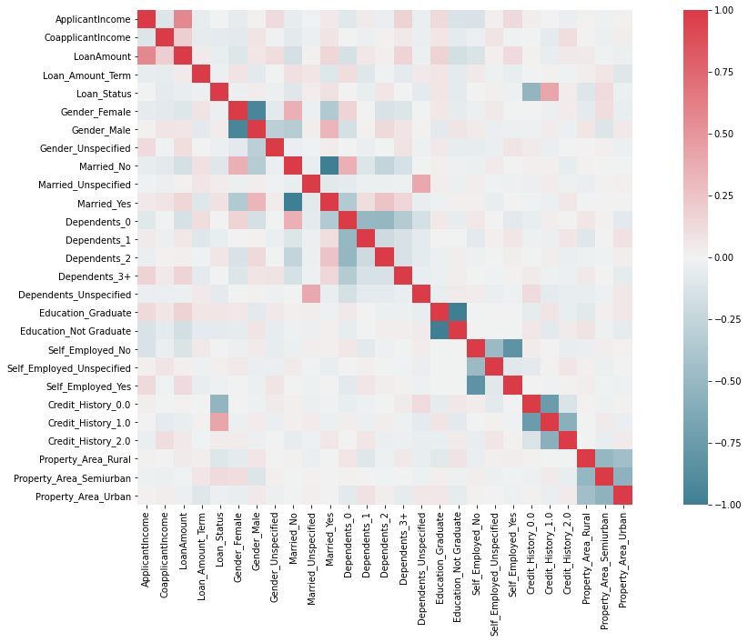

# Machine Learning Project: Logistic Regression

For this project, we will reuse much of the functions and logic of our previous work on linear regression (https://github.com/iv-stpn/linear-regression-examples).

Like last time, first of all, we create a cell for all the libraries we will need to import for our project. We will use pandas to import and manipulate data easily through DataFrames, NumPy for linear algebra & complex operations over lists, Matplotlib for displaying 2D plots, Seaborn for displaying correlation heatmaps, scikit-learn for model engineering & some extra utilities.

```python
import time
from math import sqrt

import numpy as np
import seaborn as sns
import pandas as pd
import matplotlib.pyplot as plt

from sklearn import linear_model
from sklearn.decomposition import PCA
from sklearn.tree import DecisionTreeRegressor,DecisionTreeClassifier
from sklearn.ensemble import GradientBoostingRegressor, GradientBoostingClassifier
from sklearn.ensemble import RandomForestRegressor, RandomForestClassifier

from sklearn.tree import plot_tree
from sklearn.tree import export_graphviz
from sklearn.preprocessing import MinMaxScaler
from sklearn.preprocessing import PolynomialFeatures
from sklearn.model_selection import train_test_split
from sklearn.metrics import mean_absolute_error, mean_squared_error, r2_score, confusion_matrix, f1_score, precision_score, recall_score

import tensorflow as tf
import warnings
```

We set some parameters to increase the height of Matplotlib figures, pandas print outputs so they can be displayed properly in the notebook and to assure that DeprecationWarnings will not be displayed.


```python
from pylab import rcParams
rcParams['figure.figsize'] = 20, 5

pd.set_option('display.max_rows', 500)
pd.set_option('display.max_columns', 30)
pd.set_option('display.width', 1000)

warnings.filterwarnings("ignore", category=DeprecationWarning) 
```

We create a function to display and analyse the results of our regressions feature-by-feature (with scatter plots & lines corresponding to the coefficients of each weight).


```python
def plot_weights_data_biasless(plt, X, y, w, title, same_scale = True):
    intercept = w[0]
    w = w[1:]
    
    n = len(w)
    fig, axs = plt.subplots(2, n)
    fig.suptitle(title, fontsize=20)
    y_scale_line = (-1*((max(y)-min(y))/2), (max(y)-min(y))/2)
    y_scale = (min(y), max(y))
    
    x_minimums = X.T.min(axis = 1)
    x_maximums = X.T.max(axis = 1)
    x_size = x_maximums - x_minimums
    max_size = max(x_size)
    
    x = np.linspace(-100, 100, 100)
    for i in range(n):
        if same_scale:
            diff_size = max_size - x_size[i]
            x_scale = (x_minimums[i] - diff_size/2, x_maximums[i] + diff_size/2)            # We make it so all x scales are on the same scale
            
            if (n > 1):
                axs[0][i].set_xlim(x_scale)
                axs[0][i].set_ylim(y_scale)
            else:
                axs[0].set_xlim(x_scale)
                axs[0].set_ylim(y_scale)

            #axs[0][i].scatter(X[:, i], y, c=) 
            heatmap, xedges, yedges = np.histogram2d(np.concatenate((X[:, i], x_scale)),    # We add a point in the upper-left corner and upper-right corner of the heatmap
                                                     np.concatenate((y, y_scale)), bins=50) # so all heatmaps will have the same edges and be displayed correctly
        else:
            heatmap, xedges, yedges = np.histogram2d(X[:, i], y, bins=50)
        
        extent = [xedges[0], xedges[-1], yedges[0], yedges[-1]]
        
        if (n > 1):
            axs[1][i].set_xlim((-2, 2))
            axs[1][i].set_ylim(y_scale_line)
            axs[1][i].plot(x, w[i]*x, c="red", linewidth=2)
        else:
            axs[1].set_xlim((-2, 2))
            axs[1].set_ylim(y_scale_line)
            axs[1].plot(x, w[i]*x, c="red", linewidth=2)
        
    fig.tight_layout()
```

# First Dataset: Analysis & Model Fitting of the Loan Approval Dataset

The dataset can found in the project folder (loan_prediction.csv), and was originally used in an Analytics Vidhya practice problem (https://datahack.analyticsvidhya.com/contest/practice-problem-loan-prediction-iii/). It contains 12 variables and one output and only 615 rows.


```python
def load_data_csv(csv_path, drops=[]):
    df = pd.read_csv(csv_path)  

    for drop in drops:                               # We add an optional "drops" argument, telling which columns to drop as soon as the data is loaded
        df = df.drop(drop, axis=1)
    
    return df
```


```python
def put_nan_in_front(array):
    idx = -1
    if (array.dtype == "object"):
        is_string = [type(value) == str for value in array]
        if any(is_string):
            idx = is_string.index(False) if False in is_string else -1
        else:
            idx = -1
    else:
        for dtype in ("int64", "float64"):
            if array.dtype == dtype:
                idx = np.argwhere(np.isnan(np.array(array, dtype=dtype)))
                if idx.size == 0:
                    idx = -1
                break

    array = [str(i) for i in array]
    
    if idx > 0:
        array[int(idx)], array[0] = array[0], "N/A"
    elif idx == 0:
        array[0] = "N/A"
    
    return array

def string_shortener(string, limit):
    if len(string) > limit:
        string = string[:limit-4] + " ..."
    return string

join = lambda array, delim: delim.join([str(i) for i in array])
join_shorten = lambda array, delim, limit: string_shortener(join(array, delim), limit)
join_shorten_ = lambda array: join_shorten(array, " - ", 40)

def unique_df(df):
    number_unique = []
    unique = []
    unique_count_values = []
    unique_count_proportions = []

    for column in df.columns:
        unique_column = df[column].unique()
        unique_count = df.groupby(column)["Loan_ID"].nunique()

        n_unique_without_nan = len(unique_count.index)
        unique_count = unique_count.values

        if (len(unique_column) > n_unique_without_nan):
            unique_count = np.concatenate([[len(df) - sum(unique_count)], unique_count])
        
        unique_column = put_nan_in_front(unique_column)
        number_unique.append(len(unique_column))
        unique.append(join_shorten_(unique_column))
        unique_count_values.append(join_shorten_(unique_count))
        unique_count_proportions.append(join_shorten_(map(lambda x: str(x) + "%", np.round(unique_count/sum(unique_count), 2))))


    df_unique = pd.DataFrame(zip(df.columns, number_unique, [str(dtype) for dtype in df.dtypes], unique, unique_count_values, unique_count_proportions),
                            columns = ["Column names", "# Unique Values", "Data Type", "Unique values", "Unique value counts", "Unique value proportions"])

    df.set_index("Loan_ID", inplace=True)
    print(df.columns)
    print()
    print("Sample of 10 individuals from the dataset:")
    print()
    print(df.sample(10))
    print()
    print("Unique values:")
    print()
    print(df_unique)

    return df_unique, df
```


```python
df = load_data_csv("loan_prediction.csv")
df_unique, df = unique_df(df)
```

    Index(['Gender', 'Married', 'Dependents', 'Education', 'Self_Employed', 'ApplicantIncome', 'CoapplicantIncome', 'LoanAmount', 'Loan_Amount_Term', 'Credit_History', 'Property_Area', 'Loan_Status'], dtype='object')
    
    Sample of 10 individuals from the dataset:
    
              Gender Married Dependents     Education Self_Employed  ApplicantIncome  CoapplicantIncome  LoanAmount  Loan_Amount_Term  Credit_History Property_Area Loan_Status
    Loan_ID                                                                                                                                                                    
    LP002585    Male     Yes          0      Graduate            No             3597             2157.0       119.0             360.0             0.0         Rural           N
    LP002739    Male     Yes          0  Not Graduate            No             2917              536.0        66.0             360.0             1.0         Rural           N
    LP002757  Female     Yes          0  Not Graduate            No             3017              663.0       102.0             360.0             NaN     Semiurban           Y
    LP001478    Male      No          0      Graduate            No             2718                0.0        70.0             360.0             1.0     Semiurban           Y
    LP002785    Male     Yes          1      Graduate            No             3333             3250.0       158.0             360.0             1.0         Urban           Y
    LP002305  Female      No          0      Graduate            No             4547                0.0       115.0             360.0             1.0     Semiurban           Y
    LP002101    Male     Yes          0      Graduate           NaN            63337                0.0       490.0             180.0             1.0         Urban           Y
    LP001841    Male      No          0  Not Graduate           Yes             2583             2167.0       104.0             360.0             1.0         Rural           Y
    LP001003    Male     Yes          1      Graduate            No             4583             1508.0       128.0             360.0             1.0         Rural           N
    LP001123    Male     Yes          0      Graduate            No             2400                0.0        75.0             360.0             NaN         Urban           Y
    
    Unique values:
    
             Column names  # Unique Values Data Type                             Unique values                       Unique value counts                  Unique value proportions
    0             Loan_ID              614    object  LP001002 - LP001003 - LP001005 - LP0 ...  1 - 1 - 1 - 1 - 1 - 1 - 1 - 1 - 1 -  ...  0.0% - 0.0% - 0.0% - 0.0% - 0.0% - 0 ...
    1              Gender                3    object                       N/A - Female - Male                            13 - 112 - 489                      0.02% - 0.18% - 0.8%
    2             Married                3    object                            N/A - Yes - No                             3 - 213 - 398                      0.0% - 0.35% - 0.65%
    3          Dependents                5    object                      N/A - 1 - 2 - 3+ - 0                 15 - 345 - 102 - 101 - 51     0.02% - 0.56% - 0.17% - 0.16% - 0.08%
    4           Education                2    object                   Graduate - Not Graduate                                 480 - 134                             0.78% - 0.22%
    5       Self_Employed                3    object                            N/A - Yes - No                             32 - 500 - 82                     0.05% - 0.81% - 0.13%
    6     ApplicantIncome              505     int64  5849 - 4583 - 3000 - 2583 - 6000 - 5 ...  1 - 1 - 1 - 1 - 1 - 1 - 2 - 1 - 1 -  ...  0.0% - 0.0% - 0.0% - 0.0% - 0.0% - 0 ...
    7   CoapplicantIncome              287   float64  0.0 - 1508.0 - 2358.0 - 4196.0 - 151 ...  273 - 1 - 1 - 1 - 1 - 1 - 1 - 1 - 1  ...  0.44% - 0.0% - 0.0% - 0.0% - 0.0% -  ...
    8          LoanAmount              204   float64  N/A - 128.0 - 66.0 - 120.0 - 141.0 - ...  22 - 1 - 1 - 2 - 1 - 2 - 1 - 1 - 2 - ...  0.04% - 0.0% - 0.0% - 0.0% - 0.0% -  ...
    9    Loan_Amount_Term               11   float64  N/A - 120.0 - 240.0 - 360.0 - 180.0  ...  14 - 1 - 2 - 2 - 4 - 3 - 44 - 4 - 13 ...  0.02% - 0.0% - 0.0% - 0.0% - 0.01% - ...
    10     Credit_History                3   float64                           N/A - 0.0 - 1.0                             50 - 89 - 475                     0.08% - 0.14% - 0.77%
    11      Property_Area                3    object                 Urban - Rural - Semiurban                           179 - 233 - 202                     0.29% - 0.38% - 0.33%
    12        Loan_Status                2    object                                     Y - N                                 192 - 422                             0.31% - 0.69%


The "Loan ID" column, using unique identifiers for each row (individual) will serve as our index. The "Loan Status" column, indicating whether a given loan application was accepted or denied, will serve as our output feature; since it is a binary variable, we know that our prediction problem can be solved using a Binary Logistic Regression. We will showcase different types of Logistic Regression models to achieve the best prediction scores.

As we can notice, there are some data points missing; mainly, we are missing 4% of the Loan Amounts, 5% of the employment information (self-employed or not), and 8% of the credit histories. To start our first analysis of the variables (by studying intercorrelations for example), we will need to fill those missing data points with approximative data, estimating what the true data could have been. However, paradoxically, we need to know more about our data to be able to fill those data points meaningfully, because if we just fill them using the averages or the modes of the columns, we might end up with a biased model based on incorrect assumptions that our missing data points were similar the means of the columns. As a compromise, we will consider missing data in our categorical variables as a special category ("Unspecified data") before one-hot encoding them, and remove rows with missing data in the case of the critical numerical column (i.e. the Loan Amount & the Loan Amount Term), and then add the rows back with an adapted prediction of what the value could have realistically been based on the other information we still have about the row.


```python
def one_hot_encoded_filled_dataset():
    df = load_data_csv("loan_prediction.csv")
    df.set_index("Loan_ID", inplace=True)
    df["Gender"] = df["Gender"].fillna("Unspecified")
    df["Married"] = df["Married"].fillna("Unspecified")
    df["Dependents"] = df["Dependents"].fillna("Unspecified")
    df["Self_Employed"] = df["Self_Employed"].fillna("Unspecified")
    df["Credit_History"] = df["Credit_History"].fillna(2.0)
    df = df.replace({"Loan_Status": {"N": "0", "Y": "1"}})
    df["Loan_Status"] = pd.to_numeric(df["Loan_Status"])

    df = pd.get_dummies(data=df, columns=["Gender", "Married", "Dependents", "Education", "Self_Employed", "Credit_History", "Property_Area"])
    col_list = list(df)
    idx = col_list.index("Loan_Status")
    col_list[idx], col_list[-1] = col_list[-1], col_list[idx]

    return df

def drop_na_loan_amounts_model():
    df = one_hot_encoded_filled_dataset()
    df = df.dropna()
    return df
```


```python
df = drop_na_loan_amounts_model()

print(df.dtypes)
print(df)

corr = df.corr()

print(corr)

fig, ax = plt.subplots(1, 1, figsize=(20,10))
sns.heatmap(corr, mask=np.zeros_like(corr, dtype=np.bool), cmap=sns.diverging_palette(220, 10, as_cmap=True), square=True)

print("");
```

    ApplicantIncome                int64
    CoapplicantIncome            float64
    LoanAmount                   float64
    Loan_Amount_Term             float64
    Loan_Status                    int64
    Gender_Female                  uint8
    Gender_Male                    uint8
    Gender_Unspecified             uint8
    Married_No                     uint8
    Married_Unspecified            uint8
    Married_Yes                    uint8
    Dependents_0                   uint8
    Dependents_1                   uint8
    Dependents_2                   uint8
    Dependents_3+                  uint8
    Dependents_Unspecified         uint8
    Education_Graduate             uint8
    Education_Not Graduate         uint8
    Self_Employed_No               uint8
    Self_Employed_Unspecified      uint8
    Self_Employed_Yes              uint8
    Credit_History_0.0             uint8
    Credit_History_1.0             uint8
    Credit_History_2.0             uint8
    Property_Area_Rural            uint8
    Property_Area_Semiurban        uint8
    Property_Area_Urban            uint8
    dtype: object
              ApplicantIncome  CoapplicantIncome  LoanAmount  Loan_Amount_Term  Loan_Status  Gender_Female  Gender_Male  Gender_Unspecified  Married_No  Married_Unspecified  Married_Yes  Dependents_0  Dependents_1  Dependents_2  Dependents_3+  Dependents_Unspecified  Education_Graduate  Education_Not Graduate  Self_Employed_No  Self_Employed_Unspecified  Self_Employed_Yes  Credit_History_0.0  Credit_History_1.0  Credit_History_2.0  Property_Area_Rural  Property_Area_Semiurban  Property_Area_Urban
    Loan_ID                                                                                                                                                                                                                                                                                                                                                                                                                                                                                                          
    LP001003             4583             1508.0       128.0             360.0            0              0            1                   0           0                    0            1             0             1             0              0                       0                   1                       0                 1                          0                  0                   0                   1                   0                    1                        0                    0
    LP001005             3000                0.0        66.0             360.0            1              0            1                   0           0                    0            1             1             0             0              0                       0                   1                       0                 0                          0                  1                   0                   1                   0                    0                        0                    1
    LP001006             2583             2358.0       120.0             360.0            1              0            1                   0           0                    0            1             1             0             0              0                       0                   0                       1                 1                          0                  0                   0                   1                   0                    0                        0                    1
    LP001008             6000                0.0       141.0             360.0            1              0            1                   0           1                    0            0             1             0             0              0                       0                   1                       0                 1                          0                  0                   0                   1                   0                    0                        0                    1
    LP001011             5417             4196.0       267.0             360.0            1              0            1                   0           0                    0            1             0             0             1              0                       0                   1                       0                 0                          0                  1                   0                   1                   0                    0                        0                    1
    ...                   ...                ...         ...               ...          ...            ...          ...                 ...         ...                  ...          ...           ...           ...           ...            ...                     ...                 ...                     ...               ...                        ...                ...                 ...                 ...                 ...                  ...                      ...                  ...
    LP002978             2900                0.0        71.0             360.0            1              1            0                   0           1                    0            0             1             0             0              0                       0                   1                       0                 1                          0                  0                   0                   1                   0                    1                        0                    0
    LP002979             4106                0.0        40.0             180.0            1              0            1                   0           0                    0            1             0             0             0              1                       0                   1                       0                 1                          0                  0                   0                   1                   0                    1                        0                    0
    LP002983             8072              240.0       253.0             360.0            1              0            1                   0           0                    0            1             0             1             0              0                       0                   1                       0                 1                          0                  0                   0                   1                   0                    0                        0                    1
    LP002984             7583                0.0       187.0             360.0            1              0            1                   0           0                    0            1             0             0             1              0                       0                   1                       0                 1                          0                  0                   0                   1                   0                    0                        0                    1
    LP002990             4583                0.0       133.0             360.0            0              1            0                   0           1                    0            0             1             0             0              0                       0                   1                       0                 0                          0                  1                   1                   0                   0                    0                        1                    0
    
    [578 rows x 27 columns]
                               ApplicantIncome  CoapplicantIncome  LoanAmount  Loan_Amount_Term  Loan_Status  Gender_Female  Gender_Male  Gender_Unspecified  Married_No  Married_Unspecified  Married_Yes  Dependents_0  Dependents_1  Dependents_2  Dependents_3+  Dependents_Unspecified  Education_Graduate  Education_Not Graduate  Self_Employed_No  Self_Employed_Unspecified  Self_Employed_Yes  Credit_History_0.0  Credit_History_1.0  Credit_History_2.0  Property_Area_Rural  Property_Area_Semiurban  Property_Area_Urban
    ApplicantIncome                   1.000000          -0.113640    0.571298         -0.047348    -0.005665      -0.059921     0.013572            0.119380   -0.048198            -0.010870     0.049425     -0.088320      0.041960     -0.035721       0.167397               -0.032377            0.130951               -0.130951         -0.125412                   0.019030           0.130920            0.027859            0.002693           -0.038371             0.010907                -0.021020             0.011351
    CoapplicantIncome                -0.113640           1.000000    0.188855         -0.059797    -0.070154      -0.077972     0.077875           -0.008865   -0.070451            -0.024894     0.073353     -0.006084     -0.027389      0.009946       0.051355               -0.032595            0.067427               -0.067427         -0.031917                   0.075954          -0.013104           -0.004364           -0.068682            0.107764             0.002323                -0.030952             0.030129
    LoanAmount                        0.571298           0.188855    1.000000          0.039447    -0.041898      -0.107545     0.063342            0.107952   -0.149821             0.008099     0.148482     -0.141100      0.062363      0.016137       0.159605               -0.023450            0.169050               -0.169050         -0.120189                   0.021308           0.123463            0.010839           -0.041954            0.049173             0.039493                -0.011200            -0.026840
    Loan_Amount_Term                 -0.047348          -0.059797    0.039447          1.000000    -0.029979       0.080176    -0.076218           -0.001408    0.096716             0.070163    -0.105125      0.105251     -0.096584     -0.012851      -0.067406                0.050895            0.067873               -0.067873          0.048067                  -0.021990          -0.040584           -0.006893            0.012656           -0.010366             0.028239                 0.063672            -0.094219
    Loan_Status                      -0.005665          -0.070154   -0.041898         -0.029979     1.000000      -0.028282     0.036977           -0.027021   -0.096014             0.038830     0.091018      0.006022     -0.046668      0.066947      -0.006374               -0.062505            0.068168               -0.068168          0.005854                   0.018385          -0.018693           -0.527071            0.410319            0.038334            -0.106231                 0.124514            -0.026600
    Gender_Female                    -0.059921          -0.077972   -0.107545          0.080176    -0.028282       1.000000    -0.930711           -0.071884    0.358012            -0.027925    -0.353758      0.159952      0.002525     -0.130728      -0.110213               -0.006293            0.057036               -0.057036         -0.027363                   0.050349          -0.001593            0.006665           -0.027197            0.032322            -0.068733                 0.107618            -0.045529
    Gender_Male                       0.013572           0.077875    0.063342         -0.076218     0.036977      -0.930711     1.000000           -0.297907   -0.328980             0.030003     0.324536     -0.150805      0.011113      0.127444       0.075704                0.014122           -0.072692                0.072692          0.043742                  -0.035173          -0.027035           -0.021615            0.037582           -0.029367             0.063911                -0.111242             0.054031
    Gender_Unspecified                0.119380          -0.008865    0.107952         -0.001408    -0.027021      -0.071884    -0.297907            1.000000   -0.037258            -0.008938     0.038273     -0.006220     -0.036895     -0.006348       0.081202               -0.022087            0.049372               -0.049372         -0.047870                  -0.035491           0.077883            0.041549           -0.031504           -0.004276             0.005104                 0.022482            -0.028515
    Married_No                       -0.048198          -0.070451   -0.149821          0.096716    -0.096014       0.358012    -0.328980           -0.037258    1.000000            -0.043026    -0.992419      0.356129     -0.114042     -0.252480      -0.140754               -0.004408            0.018553               -0.018553         -0.026101                   0.042045           0.002386            0.016156            0.021978           -0.052686             0.009824                -0.001817            -0.007690
    Married_Unspecified              -0.010870          -0.024894    0.008099          0.070163     0.038830      -0.027925     0.030003           -0.008938   -0.043026             1.000000    -0.080089     -0.066319     -0.026462     -0.026625      -0.017733                0.404689            0.030321               -0.030321          0.028086                  -0.013787          -0.023101           -0.023446            0.031427           -0.017934            -0.037878                 0.013382             0.022979
    Married_Yes                       0.049425           0.073353    0.148482         -0.105125     0.091018      -0.353758     0.324536            0.038273   -0.992419            -0.080089     1.000000     -0.347155      0.117037      0.255177       0.142614               -0.045386           -0.022241                0.022241          0.022587                  -0.040253           0.000461           -0.013235           -0.025794            0.054771            -0.005142                 0.000167             0.004846
    Dependents_0                     -0.088320          -0.006084   -0.141100          0.105251     0.006022       0.159952    -0.150805           -0.006220    0.356129            -0.066319    -0.347155      1.000000     -0.505411     -0.508538      -0.338699               -0.163875            0.048113               -0.048113          0.060952                   0.003696          -0.072079           -0.042066            0.029617            0.007726             0.065564                 0.009038            -0.073480
    Dependents_1                      0.041960          -0.027389    0.062363         -0.096584    -0.046668       0.002525     0.011113           -0.036895   -0.114042            -0.026462     0.117037     -0.505411      1.000000     -0.202911      -0.135144               -0.065388            0.003485               -0.003485         -0.072034                   0.020148           0.069181           -0.016952           -0.028086            0.062773            -0.095283                 0.002283             0.090648
    Dependents_2                     -0.035721           0.009946    0.016137         -0.012851     0.066947      -0.130728     0.127444           -0.006348   -0.252480            -0.026625     0.255177     -0.508538     -0.202911      1.000000      -0.135980               -0.065792           -0.028156                0.028156         -0.022058                  -0.001798           0.026386           -0.005295            0.030008           -0.038203            -0.016766                -0.010863             0.027741
    Dependents_3+                     0.167397           0.051355    0.159605         -0.067406    -0.006374      -0.110213     0.075704            0.081202   -0.140754            -0.017733     0.142614     -0.338699     -0.135144     -0.135980       1.000000               -0.043819           -0.030075                0.030075         -0.001843                  -0.013887           0.011172            0.044524           -0.020690           -0.024066             0.054658                 0.004049            -0.057608
    Dependents_Unspecified           -0.032377          -0.032595   -0.023450          0.050895    -0.062505      -0.006293     0.014122           -0.022087   -0.004408             0.404689    -0.045386     -0.163875     -0.065388     -0.065792      -0.043819                1.000000           -0.044376                0.044376          0.038160                  -0.034068          -0.021375            0.118682           -0.068456           -0.044315            -0.040245                -0.016705             0.056783
    Education_Graduate                0.130951           0.067427    0.169050          0.067873     0.068168       0.057036    -0.072692            0.049372    0.018553             0.030321    -0.022241      0.048113      0.003485     -0.028156      -0.030075               -0.044376            1.000000               -1.000000         -0.004376                   0.005373           0.001494           -0.055238            0.073782           -0.041865            -0.080600                 0.018334             0.059512
    Education_Not Graduate           -0.130951          -0.067427   -0.169050         -0.067873    -0.068168      -0.057036     0.072692           -0.049372   -0.018553            -0.030321     0.022241     -0.048113     -0.003485      0.028156       0.030075                0.044376           -1.000000                1.000000          0.004376                  -0.005373          -0.001494            0.055238           -0.073782            0.041865             0.080600                -0.018334            -0.059512
    Self_Employed_No                 -0.125412          -0.031917   -0.120189          0.048067     0.005854      -0.027363     0.043742           -0.047870   -0.026101             0.028086     0.022587      0.060952     -0.072034     -0.022058      -0.001843                0.038160           -0.004376                0.004376          1.000000                  -0.490895          -0.822517            0.034035            0.003267           -0.046841            -0.036377                 0.024230             0.010158
    Self_Employed_Unspecified         0.019030           0.075954    0.021308         -0.021990     0.018385       0.050349    -0.035173           -0.035491    0.042045            -0.013787    -0.040253      0.003696      0.020148     -0.001798      -0.013887               -0.034068            0.005373               -0.005373         -0.490895                   1.000000          -0.091727           -0.070392            0.012089            0.068788             0.021062                -0.026844             0.007531
    Self_Employed_Yes                 0.130920          -0.013104    0.123463         -0.040584    -0.018693      -0.001593    -0.027035            0.077883    0.002386            -0.023101     0.000461     -0.072079      0.069181      0.026386       0.011172               -0.021375            0.001494               -0.001494         -0.822517                  -0.091727           1.000000            0.007052           -0.011625            0.008633             0.027828                -0.010171            -0.016527
    Credit_History_0.0                0.027859          -0.004364    0.010839         -0.006893    -0.527071       0.006665    -0.021615            0.041549    0.016156            -0.023446    -0.013235     -0.042066     -0.016952     -0.005295       0.044524                0.118682           -0.055238                0.055238          0.034035                  -0.070392           0.007052            1.000000           -0.746044           -0.121097             0.009981                -0.018104             0.009203
    Credit_History_1.0                0.002693          -0.068682   -0.041954          0.012656     0.410319      -0.027197     0.037582           -0.031504    0.021978             0.031427    -0.025794      0.029617     -0.028086      0.030008      -0.020690               -0.068456            0.073782               -0.073782          0.003267                   0.012089          -0.011625           -0.746044            1.000000           -0.570652            -0.005262                 0.041249            -0.038038
    Credit_History_2.0               -0.038371           0.107764    0.049173         -0.010366     0.038334       0.032322    -0.029367           -0.004276   -0.052686            -0.017934     0.054771      0.007726      0.062773     -0.038203      -0.024066               -0.044315           -0.041865                0.041865         -0.046841                   0.068788           0.008633           -0.121097           -0.570652            1.000000            -0.004465                -0.039164             0.045352
    Property_Area_Rural               0.010907           0.002323    0.039493          0.028239    -0.106231      -0.068733     0.063911            0.005104    0.009824            -0.037878    -0.005142      0.065564     -0.095283     -0.016766       0.054658               -0.040245           -0.080600                0.080600         -0.036377                   0.021062           0.027828            0.009981           -0.005262           -0.004465             1.000000                -0.513199            -0.439281
    Property_Area_Semiurban          -0.021020          -0.030952   -0.011200          0.063672     0.124514       0.107618    -0.111242            0.022482   -0.001817             0.013382     0.000167      0.009038      0.002283     -0.010863       0.004049               -0.016705            0.018334               -0.018334          0.024230                  -0.026844          -0.010171           -0.018104            0.041249           -0.039164            -0.513199                 1.000000            -0.545588
    Property_Area_Urban               0.011351           0.030129   -0.026840         -0.094219    -0.026600      -0.045529     0.054031           -0.028515   -0.007690             0.022979     0.004846     -0.073480      0.090648      0.027741      -0.057608                0.056783            0.059512               -0.059512          0.010158                   0.007531          -0.016527            0.009203           -0.038038            0.045352            -0.439281                -0.545588             1.000000
    


    

    


We can see that the Loan Amount is mostly correlated with the Applicant & Coapplicant Income, whether the individual is self-employed/a graduate or not and whether the individual has more than 3 financial dependants.

We will train models on the data with and without the rows where the Loan Amount is missing (recreating the values based on the observed correlations).


## Part I: Logistic Regression from Scratch

To normalize the features, we implement a function with two modes, "min-max" or "z-score" to use either of those methods for feature scaling. The function also add a 1s column for the bias (intercept) of the linear regression.


```python
def normalizeFeatures(X, mode="min-max"):   # Put all columns (classes) on the same scale (scaling) and brings them on the origin [0; 1]
                                            # And add a 1s column for the factor associated to the bias 

    X_t = X.T # Go from the individual points as lines to columns as lines (by default numpy operations are applied line by line)
              #
              # x11, x12, x13, x14    x11, x21, x31
              # x21, x22, x23, x24 -> x12, x22, x32
              # x31, x32, x33, x34    x13, x23, x33
              #                       x14, x24, x34

    # For normalization we suppose no variable has always the same value (otherwise there would a division by 0)
    # If a variable has always the same value, it should be removed from the dataset as it is pointless in the linear regression
    
    
    if (mode == "min-max"): # Feature scaling using minimums and maximums
        minimums = X_t.min(axis = 1)[:, None] # Create a new axis to convert scalars to 1-element arrays
        maximums = X_t.max(axis = 1)[:, None] # Create a new axis to convert scalars to 1-element arrays
        X_t = (X_t - minimums) / (maximums - minimums)

    elif (mode == "z-score"): # Feature scaling using z_scores
        X_t = (X_t - X_t.mean(axis = 1)[:, None]) / X_t.std(axis = 1)[:, None]

    X = X_t.T
    X = np.c_[np.ones((X.shape[0], 1)), X] # Add a 1s column to the new scaled matrix for the bias for matrix multiplications
    
    return X
```

We then implement our hypothesis function ; unlike in a linear regression, the hypothesis function of a logistic regression isn't as trivial as a matrix multiplication between the features and the weights: it will require to apply the sigmoid function to the result of our matrix multiplication (to force our hypothesis between 0 and 1).

For the reminder of this notebook, we will use the 'at' operator (@) for matrix multiplication (https://www.python.org/dev/peps/pep-0465/)


```python
def sigmoid(x):
    return 1/(1+np.exp(-x))

def hypothesis(X,w):
    return sigmoid(X @ w)
```

We will implement a Cross-Entropy Cost Function (as we are in the case of a binary output variable), that is the sum of how exponentially far the hypothesis is from a correct guess if the individual corresponds to the state y=1 ( $-y*(\log(h(X,w)))$ ) and if it corresponds to the state y=0 ( $-(1-y)*(1-\log(h(X,w)))$ ). The functions $\log(x)$ and $1-\log(x)$ are convex (for $x \in ]0; 1[$), so their sum is convex. Since the two functions are symmetrical, the sum of the two will share a common global minimum.

The final formula of the Cross-Entropy Cost Function is $-(y*(\log(h(X, w))) + (1-y)*(\log(1-h(X,w))))$. Plotted below, we can see that such a cost function punishes wrong predictions much more than it rewards correct predictions.


```python
fig, axs = plt.subplots(1, 3)
x = np.linspace(-10, 10, 100)

weight = 1
bias = -1
f = weight*x + bias
h = sigmoid(f)
h = h[(h != 0) & (h != 1)]

x = np.linspace(-10, 10, len(h))

axs[0].plot(x, -np.log(h))
axs[0].set_title("Value of J(h(X,w)) when y = 1", y=1.05)
axs[0].set_xlabel('x', fontsize=10)
axs[0].set_ylabel('f(x) = -log(x)', fontsize=10)

axs[1].plot(x, -(np.log(1-h)))
axs[1].set_title("Value of J(h(X,w)) when y = 0", y=1.05)
axs[1].set_xlabel('x', fontsize=10)
axs[1].set_ylabel('f(x) = -log(1-x)', fontsize=10)

axs[2].plot(x, -(np.log(h)+(np.log(1-h))))
axs[2].set_title("Value of J(h(X,w)) for both y values (general shape)", y=1.05)
axs[2].set_xlabel('x', fontsize=10)
axs[2].set_ylabel('f(x) = - (log(x) + log(1-x))', fontsize=10)

x_sigmoid = np.linspace(0.01, 0.99, 100)

fig.tight_layout()

print()
```

    


    

    


We will also experiment with the Squared Loss Cost Function, where the cost function is the sum of the squares of how far the hypothesis is from the correct answer in the case where y = 0 ( $y*(h(X,w)^2)$ ) and y = 1 ( $(1-y)*(1-h(X,w))^2$ ).

The final formula of our Squared Loss Cost Function is: $y*(h(X,w)^2)+(1-y)*(1-h(X,w))^2$.

Traditionnally, this cost function is not used in logistic regression because it is neither convex nor concave (https://math.stackexchange.com/questions/1985008/show-that-logistic-regression-with-squared-loss-function-is-non-convex, https://www.internalpointers.com/post/cost-function-logistic-regression).

However, such a cost function can still be used for logistic regression as it has a global minimum, and following its gradient descent will always lead to its global minimum; if we are too far from the minimum, the function will struggle to go back towards it, which is why we need to use a very small $\Delta$, and a very large $\alpha$.

As we will see, the Squared Loss Cost Function for logistic regression is much more computationnally effective than the Log Loss for each successive cost is much less computationally-friendly than calculating polynomials in the cost function & the gradient (see calculation of the Squared Loss Cost Function below).


```python
fig, ax = plt.subplots(1, 3)
x = np.linspace(-10, 10, 1000)

weight = 1
bias = -1
f = weight*x + bias
h = sigmoid(f)
h = h[(h != 0) & (h != 1)]

x = np.linspace(-10, 10, len(h))

ax[0].plot(x, (1-h)**2)
ax[0].set_title("Value of J(h(X,w)) when y = 1", y=1.05)
ax[0].set_xlabel('x', fontsize=10)
ax[0].set_ylabel('f(x) = (1-x)²', fontsize=10)

ax[1].plot(x, h**2)
ax[1].set_title("Value of J(h(X,w)) when y = 0", y=1.05)
ax[1].set_xlabel('x', fontsize=10)
ax[1].set_ylabel('f(x) = x²', fontsize=10)

ax[2].plot(x, (1-h)**2+h**2)
ax[2].set_title("Value of J(h(X,w)) for both y values (general shape)", y=1.05)
ax[2].set_xlabel('x', fontsize=10)
ax[2].set_ylabel('f(x) =  (1-x)² + x²', fontsize=10)

print()

```

    


    

    


$ 
\begin{align}
\dfrac{\delta}{\delta w} J \big( h(X, w) \big) &= \dfrac{\delta}{\delta w} \Big( y\big(1-h(X, w)\big)² + (1-y)h(X, w)² \Big) \\
&= \dfrac{\delta}{\delta w} \big( y + yh(X, w)² - 2yh(X, w) + h(X, w)² - yh(X, w)² \big) \\[0.1cm]
&= \dfrac{\delta}{\delta w} \big( h(X, w)² - 2yh(X, w) + y \big) \\[0.1cm]
&= \ 2h'(X, w) h(X,w) - 2h'(X, w)y \\[0.2cm]
&= \ 2σ'(Xw) σ(Xw) - 2σ'(Xw)y\\[0.1cm]
&= \bigg( 2X^T\Big( \big[ \big(1-σ(Xw)\big)σ(Xw) \big]σ(Xw) \Big) - 2X^T\Big( \big[ σ(Xw)\big(1-σ(Xw)\big) \big]y \Big) \bigg) \ \ \ \ \ \ \Big( \text{because } \dfrac{d}{dw} ( σ(Xw) ) = X^Tσ(Xw)(1-σ(Xw)) \Big) \\
&= 2X^T \Big( -σ³(Xw) + σ²(Xw) - y\big( -σ(Xw)² + σ\left(Xw\right) \big) \Big) \\[0.1cm]
\nabla{J \big( h(X, w) \big)} &= 2X^T \big( -σ(Xw)³ + (1+y) σ(Xw)² - yσ(Xw) \big)
\end{align}
$


```python
def cross_entropy_func(h, y):
    if h != 1 and h != 0:
        return y*np.log(h) + (1-y)*np.log(1-h)
    else:
        return -40 * (y*(1-h) + (1-y)*h)                 # Caps the log(0) to -40 to avoid -infinity
        

cross_entropy = np.vectorize(cross_entropy_func)

def costFunction(h, m, y, function="cross-entropy"):    # We directly use the hypothesis as the argument to avoid recalculating the sigmoid,
                                                        # to increase performances
                                                        
    if function == "cross-entropy":                     # Implementation of the cross-entropy cost function
        return -np.sum(cross_entropy(h, y)) / m
    elif function == "squares":                         # Implementation of our custom squared cost function
        return np.sum(y*((1-h)**2) + (1-y)*(h**2)) / m
    else:
        raise(Exception("Error: cost function '" + str(function) + "' isn't defined for logistic regression."))

```

For the implementation of the gradient descent, we follow the general algorithm : while the maximal iteration has not been reached or the cost difference isn't small enough, we calculate new weights, equal to the previous weights minus the gradient of the cost function over the weights. To simplify the calculations "from scratch", we can use matrix multiplications to modelize the iterative substraction of each component of the gradient. Depending on the cost function used, we need to use the right gradient (derivative) formula of the function over 𝛿w. When the cost difference is negative (meaning the learning rate (α) is too large, as the function is convex), we decrease the learning rate.


```python
def gradientDescent(alpha, w, X, y, iterations, delta, function="cross-entropy", print_every=500, print_first=10):
    previous_cost = -1
    curr_cost = -1
    i = 0
    costs = []
    decrease_factor = 0.9

    m = len(X)
        
    start = time.time() * 1000

    first_print = True

    h = hypothesis(X, w)

    while (i < iterations and (i < 1 or previous_cost-curr_cost > delta or previous_cost-curr_cost < 0)):
        if (previous_cost-curr_cost < 0 and i > 1):
            alpha = alpha * decrease_factor
        
        # Since the cost function is the sum of the costs associated to each errors, the gradient of the cost function
        # can be expressed as the sum of the derivatives for the costs associated to the error (since the derivative of a sum is the sum of the derivatives)

        # For the calculations relating to our two cost functions, see above for the equations
    
        if function == "cross-entropy":
            gradient = ( X.T @ (h - y) ) / m
        elif function == "squares": 
            gradient = ( 2 * X.T @ (- h**3 + (1+y)*(h**2) - y*h) ) / m
        
        w = w - alpha*gradient

        h = hypothesis(X, w)

        previous_cost = curr_cost
        curr_cost = costFunction(h, m, y, function)
    
        costs.append(curr_cost)                                           # We keep costs in memory to plot them afterwards

        if ((print_every > 0 and i%print_every == 0) or (print_first > 0 and i < print_first)):  # We only print the "print_first" first iterations and then every
                                                                                                 # "print_every" iterations
            if (first_print):
                print("{: >10} {: >40} {: >40} {: >20}".format("curr iter", "cost difference", "curr cost", "alpha"))
                print()
                first_print = False
            
            diff_cost = previous_cost-curr_cost
            print("{: >10} {: >40} {: >40} {: >20}".format(i, np.round(diff_cost, 3) if diff_cost > 0.001 else ("N/A" if previous_cost == -1 else diff_cost), np.round(curr_cost, 3),
             np.round(alpha, 3)))

        i+=1
    
    end = time.time() * 1000
    
    print()
    print("Weights found: ", w)

    return w, end-start, costs, i, curr_cost
```

We implement our own functions to calculate the mean absolute error, the root mean squared error and the R squared score (coefficient of determination) of our regressions.

We can reuse our cost function implementation to calculate the errors. However, for the rest of the notebook, we will use scikit-learn's error functions to calculate our errors quicker and with more precision.


```python
def meanAbsoluteError(y_true, y_pred):               # The sum of the absolute values of the error divided by the number of individuals
    return np.sum(np.abs(y_true - y_pred)) / len(y_true)
    
def rootMeanSquaredError(y_true, y_pred):            # The sum of the squares of the error divided by the number of individuals
    error = y_true - y_pred 

    return sqrt((error.T @ error) / len(y_true))

def r2(y_true, y_pred):                              # One minus the error squared divided by the variance squared
    error = y_true - y_pred    
    var = y_true - y_true.mean()

    return 1 - (error.T @ error) / (var.T @ var)

def accuracy(y_true, y_pred):
    return np.count_nonzero((y_pred == y_true))/len(y_true)

def confusion_matrix_from_scratch(y_true, y_pred):   

    # The matrix follows the sklearn confusion matrix convention [ [ tn, fp ],    instead of [ [ tp, fp ],
    #                                                              [ fn, tp ] ]                [ fn, tn ] ]

    matrix = np.zeros((2, 2))
    for (true, pred) in zip(y_true, y_pred):
        pos = int(true == 1)
        idx = pos, pos*(true == pred)+(1-pos)*(true != pred)
        matrix[idx]+=1

    return matrix

def f1(y_true, y_pred):
    m = confusion_matrix(y_true, y_pred)
    return m[1, 1] / ( m[1, 1] + 0.5 * (m[0, 1] + m[1, 0]) )

def precision(y_true, y_pred):
    m = confusion_matrix(y_true, y_pred)
    return m[1, 1] / ( m[1, 1] + m[0, 1] )

def recall(y_true, y_pred):
    m = confusion_matrix(y_true, y_pred)
    return m[1, 1] / ( m[1, 1] + m[1, 0] )
```

For our linear regression algorithm itself, we simply generate random weights between -10 and 10, with number of columns + 1 (the bias) components, normalize our features and launch our gradientDescent function.


```python
def load_data_wrapper_drop_na(y):
    df = drop_na_loan_amounts_model()

    X = df.drop(y, axis=1).to_numpy()
    y = df[y].to_numpy()

    return X, y, df
```


```python
def generate_cut_off_matrix(y_true, y_pred, indicator, display=True, indicator_name="Indicator"):
    best = [0, 0]
    m = np.zeros((10, 10))
    for idx_i, i in enumerate(np.arange(0, 1, 0.1)):
        for idx_j, j in enumerate(np.arange(0, 0.1, 0.01)):
            cutoff = i+j
            h = (y_pred > cutoff).astype(np.int64)
            ind = indicator(y_true, h)
            m[idx_i, idx_j] = ind
            if ind > best[1]:
                best[0] = cutoff
                best[1] = ind
    
    spacing = 2

    if display:
        print("Best: [Cutoff: %.2f, %s: %.2f]" % (best[0], indicator_name, best[1]))
        print("\n")
        print(" "*(4 + 2*spacing) + (" "*spacing).join("%.2f" % i for i in np.arange(0, 0.1, 0.01)) + "\n")
        for i in range(10):
            print(("%.2f" % (i/10)) + " "*2*spacing + (" "*spacing).join("%.2f" % m[i, j] for j in range(10)))

    return best[0]

def logistic_regression_from_scratch(y_label, loader):
    X, y, df = loader(y_label)
    
    w = np.random.randint(-10, 10, len(X[0]) + 1)
    X_normalized = normalizeFeatures(X)
    
    all_results = []
    for func in ["cross-entropy", "squares"]:
        print(func.capitalize(), "Cost Function Gradient Descent:\n")
        results = gradientDescent(40, w.copy(), X_normalized, y, 100000, 0.0000001 if func == "cross-entropy" else 0.000000006, func, 200, 20)
        all_results.append(results)

        h = hypothesis(X_normalized, results[0])
        best_cut_off = generate_cut_off_matrix(y, h, accuracy, True, "Accuracy score")
        h = (h > best_cut_off).astype(np.int64)

        print()
        print("Initial weights: ", w, "\n")
        print(str(func).capitalize() + " cost function:")
        
        print("Execution time: %.2f ms" % results[1])
        print("\nFinal w: ", results[0])
        print("\nIterations: ", results[3])
        print("Last cost: %.2f (%s)" % (results[4], func.capitalize()))
        print("Model score: %.2f (%s)" % (accuracy(y, h), func.capitalize()))

        print("Mean Absolute Error: %.2f (from scratch), %.2f (sklearn)" % ( meanAbsoluteError(y, h),
                                                                             mean_absolute_error(y, h) ))
        print("Root Mean Squared Error: %.2f (from scratch), %.2f (sklearn)" % ( rootMeanSquaredError(y, h),
                                                                                 mean_squared_error(y, h, squared=False) ))
        print("R2 Score: %.2f (from scratch), %.2f (sklearn)" % ( r2(y, h),
                                                                  r2_score(y, h) ))

        print("\nConfusion Matrix:\n", confusion_matrix_from_scratch(y, h), "\n(from scratch)\n", confusion_matrix(y, h), "\n(sklearn)\n")
        print("\nF1 Score: %.2f (from scratch), %.2f (sklearn)" % ( f1(y, h),
                                                                  f1_score(y, h) ))
        print("Precision: %.2f (from scratch), %.2f (sklearn)" % ( precision(y, h),
                                                                   precision_score(y, h) ))
        print("Recall: %.2f (from scratch), %.2f (sklearn)" % ( recall(y, h),
                                                                recall(y, h) ))
        print("****************************************************************************\n\n")

    fig, ((ax1, ax2)) = plt.subplots(1, 2)
    ax1.plot(np.linspace(0, all_results[0][3], all_results[0][3]), all_results[0][2])
    ax1.set_title("Log loss/cross-entropy cost function")

    ax2.plot(np.linspace(0, all_results[1][3], all_results[1][3]), all_results[1][2])
    ax2.set_title("Least-squares cost function")
    fig.tight_layout(pad=3.0)
    
    fig.suptitle("Evolution of the cost function with increasing iterations of the gradient descent", fontsize=20, y=1.08)
    
    return X, w, y, df
```

"Loan_Status" is the column containing our output variable. We launch the notebook in the same folder as the "loan_prediction.csv" file, containing our dataset.


```python
X, w, y, df = logistic_regression_from_scratch("Loan_Status", load_data_wrapper_drop_na)
```

    Cross-entropy Cost Function Gradient Descent:
    
     curr iter                          cost difference                                curr cost                alpha
    
             0                                      N/A                                   12.111                   40
             1                                    2.449                                    9.662                   40
             2                       -5.703832345724589                                   15.366                   40
             3                                    3.255                                   12.111                 36.0
             4                                    1.648                                   10.463                 36.0
             5                                    7.911                                    2.552                 36.0
             6                                    0.407                                    2.144                 36.0
             7                      -0.2792190238764163                                    2.423                 36.0
             8                       -4.168287680274972                                    6.592                 32.4
             9                       -5.372733833358045                                   11.965                29.16
            10                                    4.041                                    7.923               26.244
            11                                    5.889                                    2.034               26.244
            12                      -0.8647506011563135                                    2.899               26.244
            13                      -3.9709483106105443                                     6.87                23.62
            14                                    4.425                                    2.445               21.258
            15                      -0.5653753176046203                                    3.011               21.258
            16                       -3.629022185228501                                     6.64               19.132
            17                                    3.311                                    3.329               17.219
            18                                    1.771                                    1.557               17.219
            19                   -0.0004050195448035421                                    1.558               17.219
           200                    0.0006574474534865038                                    0.661                2.872
           400                    0.0006102228439823776                                    0.535                2.872
           600                    2.982883502117284e-05                                    0.455                2.584
           800                    4.090068596251939e-06                                    0.454                2.326
          1000                   2.1035777900135777e-06                                    0.453                2.326
          1200                    1.187580147499201e-06                                    0.453                2.326
          1400                    7.203599926564053e-07                                    0.452                2.326
          1600                    4.668367334925705e-07                                    0.452                2.326
          1800                    3.211163988603438e-07                                    0.452                2.326
          2000                   2.3235326690462799e-07                                    0.452                2.326
          2200                    1.751859523002608e-07                                    0.452                2.326
          2400                   1.3647769375735308e-07                                    0.452                2.326
          2600                   1.0912590453493465e-07                                    0.452                2.326
    
    Weights found:  [-4.24568369  1.22605682 -2.44425195 -1.3098636  -0.9578797  -5.01975435
     -4.96197814 -5.2639512  -4.58666666 -2.62628625 -4.03273079  1.42302637
      0.86300365  1.74360281  1.56042172  1.16426175  2.06706457  1.68725173
      2.96977418  2.91733054  2.86721159  2.0204316   5.89052199  5.84336271
      3.15729243  4.10574936  3.49127452]
    Best: [Cutoff: 0.56, Accuracy score: 0.82]
    
    
            0.00  0.01  0.02  0.03  0.04  0.05  0.06  0.07  0.08  0.09
    
    0.00    0.70  0.70  0.70  0.70  0.71  0.72  0.74  0.75  0.76  0.76
    0.10    0.78  0.78  0.80  0.80  0.80  0.80  0.80  0.80  0.80  0.81
    0.20    0.81  0.81  0.81  0.81  0.81  0.81  0.81  0.81  0.81  0.81
    0.30    0.81  0.81  0.81  0.81  0.81  0.81  0.81  0.81  0.81  0.81
    0.40    0.81  0.81  0.81  0.81  0.81  0.81  0.81  0.81  0.81  0.81
    0.50    0.81  0.81  0.81  0.81  0.81  0.81  0.82  0.81  0.81  0.81
    0.60    0.81  0.81  0.81  0.81  0.81  0.80  0.79  0.78  0.78  0.78
    0.70    0.77  0.75  0.74  0.74  0.73  0.72  0.70  0.68  0.67  0.64
    0.80    0.63  0.62  0.61  0.59  0.57  0.54  0.52  0.49  0.47  0.44
    0.90    0.41  0.36  0.35  0.33  0.31  0.30  0.30  0.30  0.30  0.30
    
    Initial weights:  [ -9   3  -4   3   6  -2  -9  -9   1  -7 -10   5  -6   7  -6   2  -7   6
       4   4  -4   6   5  -2   3  -4   7] 
    
    Cross-entropy cost function:
    Execution time: 3972.10 ms
    
    Final w:  [-4.24568369  1.22605682 -2.44425195 -1.3098636  -0.9578797  -5.01975435
     -4.96197814 -5.2639512  -4.58666666 -2.62628625 -4.03273079  1.42302637
      0.86300365  1.74360281  1.56042172  1.16426175  2.06706457  1.68725173
      2.96977418  2.91733054  2.86721159  2.0204316   5.89052199  5.84336271
      3.15729243  4.10574936  3.49127452]
    
    Iterations:  2685
    Last cost: 0.45 (Cross-entropy)
    Model score: 0.82 (Cross-entropy)
    Mean Absolute Error: 0.18 (from scratch), 0.18 (sklearn)
    Root Mean Squared Error: 0.43 (from scratch), 0.43 (sklearn)
    R2 Score: 0.13 (from scratch), 0.13 (sklearn)
    
    Confusion Matrix:
     [[ 77.  98.]
     [  8. 395.]] 
    (from scratch)
     [[ 77  98]
     [  8 395]] 
    (sklearn)
    
    
    F1 Score: 0.88 (from scratch), 0.88 (sklearn)
    Precision: 0.80 (from scratch), 0.80 (sklearn)
    Recall: 0.98 (from scratch), 0.98 (sklearn)
    ****************************************************************************
    
    
    Squares Cost Function Gradient Descent:
    
     curr iter                          cost difference                                curr cost                alpha
    
             0                                      N/A                                    0.617                   40
             1                                    0.002                                    0.615                   40
             2                                    0.002                                    0.613                   40
             3                                    0.002                                    0.611                   40
             4                                    0.002                                    0.609                   40
             5                                    0.002                                    0.607                   40
             6                                    0.002                                    0.606                   40
             7                                    0.002                                    0.604                   40
             8                                    0.002                                    0.602                   40
             9                                    0.002                                      0.6                   40
            10                                    0.003                                    0.597                   40
            11                                    0.007                                     0.59                   40
            12                                    0.031                                    0.559                   40
            13                                    0.053                                    0.506                   40
            14                                    0.014                                    0.493                   40
            15                                    0.023                                    0.469                   40
            16                                    0.052                                    0.417                   40
            17                                    0.088                                    0.329                   40
            18                                     0.01                                    0.319                   40
            19                                    0.008                                    0.311                   40
           200                    2.641084356028167e-05                                    0.177                   40
           400                   1.4467445892396569e-05                                    0.171                   40
           600                   0.00013993571000647798                                    0.153               13.947
           800                    6.202500775487341e-06                                    0.149               10.167
          1000                   2.7736599321759314e-06                                    0.148                9.151
          1200                   1.6526658342119749e-06                                    0.147                9.151
          1400                     8.81169508470947e-07                                    0.147                9.151
          1600                    4.179894569911191e-07                                    0.147                9.151
          1800                   1.7770187898946688e-07                                    0.147                8.236
          2000                    9.365705419539516e-08                                    0.147                8.236
          2200                   5.5261648729265644e-08                                    0.147                8.236
          2400                    3.661158373691187e-08                                    0.147                8.236
          2600                    2.651945466003447e-08                                    0.147                8.236
          2800                   2.0458325700190017e-08                                    0.147                8.236
          3000                   1.6565879668029027e-08                                    0.147                8.236
          3200                   1.4004303827697129e-08                                    0.147                8.236
          3400                   1.2341412503058535e-08                                    0.147                8.236
          3600                   1.1322282778003512e-08                                    0.147                8.236
          3800                   1.0782121639962838e-08                                    0.147                8.236
          4000                   1.0609659373272962e-08                                    0.147                8.236
          4200                   1.0729278521193208e-08                                    0.147                8.236
          4400                   1.1090799140189844e-08                                    0.147                8.236
          4600                   1.1662931037603741e-08                                    0.147                8.236
          4800                   1.2428822360188718e-08                                    0.147                8.236
          5000                   1.3382975228015681e-08                                    0.147                8.236
          5200                    1.452911049804051e-08                                    0.147                8.236
          5400                   1.5878689779702526e-08                                    0.147                8.236
          5600                   1.7449852784956477e-08                                    0.147                8.236
          5800                   1.9266534950768133e-08                                    0.147                8.236
          6000                   2.1357504653707338e-08                                    0.147                8.236
          6200                   2.3755004296965865e-08                                    0.147                8.236
          6400                   2.6492599086713753e-08                                    0.147                8.236
          6600                    2.960178235866806e-08                                    0.147                8.236
          6800                   3.3106944741234656e-08                                    0.147                8.236
          7000                    3.701871964523207e-08                                    0.147                8.236
          7200                    4.132689027103176e-08                                    0.147                8.236
          7400                    4.599663555593381e-08                                    0.147                8.236
          7600                    5.097658464792154e-08                                    0.147                8.236
          7800                    5.623394006004645e-08                                    0.147                8.236
          8000                     6.18390854634221e-08                                    0.147                8.236
          8200                    6.812671698996908e-08                                    0.147                8.236
          8400                    7.596642073726123e-08                                    0.147                8.236
          8600                    8.721615238349578e-08                                    0.147                8.236
          8800                    1.056192529269584e-07                                    0.147                8.236
          9000                   1.3908809903817598e-07                                    0.147                8.236
          9200                   2.0696179123258496e-07                                    0.147                8.236
          9400                   3.6924877808153234e-07                                    0.147                8.236
          9600                    8.994534506645557e-07                                    0.147                8.236
          9800                    4.467485990838904e-06                                    0.146                8.236
         10000                    2.647477215428351e-06                                    0.144                8.236
         10200                    8.701349737960662e-08                                    0.144                8.236
    
    Weights found:  [-6.00677508  0.43169539 -2.77903915 -1.43130179 -0.34511151 -5.66698503
     -5.65415796 -5.68563209 -4.9671268  -3.68338546 -4.35626282  1.01596386
      0.40205327  1.36997795  1.15614482  1.04908503  1.14648038  0.84674454
      2.31472273  2.36301139  2.3154908  -9.71553454 10.86595238 10.84280709
      2.53376045  3.45847383  3.00099065]
    Best: [Cutoff: 0.56, Accuracy score: 0.82]
    
    
            0.00  0.01  0.02  0.03  0.04  0.05  0.06  0.07  0.08  0.09
    
    0.00    0.70  0.81  0.81  0.81  0.81  0.81  0.81  0.81  0.81  0.81
    0.10    0.81  0.81  0.81  0.81  0.81  0.81  0.81  0.81  0.81  0.81
    0.20    0.81  0.81  0.81  0.81  0.81  0.81  0.81  0.81  0.81  0.81
    0.30    0.81  0.81  0.81  0.81  0.81  0.81  0.81  0.81  0.81  0.81
    0.40    0.81  0.81  0.81  0.81  0.81  0.81  0.81  0.81  0.81  0.81
    0.50    0.81  0.81  0.82  0.82  0.82  0.82  0.82  0.82  0.82  0.82
    0.60    0.81  0.81  0.81  0.80  0.81  0.80  0.79  0.79  0.78  0.76
    0.70    0.75  0.75  0.75  0.74  0.73  0.72  0.71  0.69  0.66  0.64
    0.80    0.63  0.61  0.60  0.60  0.58  0.56  0.52  0.50  0.47  0.44
    0.90    0.40  0.37  0.34  0.32  0.30  0.30  0.30  0.30  0.30  0.30
    
    Initial weights:  [ -9   3  -4   3   6  -2  -9  -9   1  -7 -10   5  -6   7  -6   2  -7   6
       4   4  -4   6   5  -2   3  -4   7] 
    
    Squares cost function:
    Execution time: 772.63 ms
    
    Final w:  [-6.00677508  0.43169539 -2.77903915 -1.43130179 -0.34511151 -5.66698503
     -5.65415796 -5.68563209 -4.9671268  -3.68338546 -4.35626282  1.01596386
      0.40205327  1.36997795  1.15614482  1.04908503  1.14648038  0.84674454
      2.31472273  2.36301139  2.3154908  -9.71553454 10.86595238 10.84280709
      2.53376045  3.45847383  3.00099065]
    
    Iterations:  10273
    Last cost: 0.14 (Squares)
    Model score: 0.82 (Squares)
    Mean Absolute Error: 0.18 (from scratch), 0.18 (sklearn)
    Root Mean Squared Error: 0.42 (from scratch), 0.42 (sklearn)
    R2 Score: 0.16 (from scratch), 0.16 (sklearn)
    
    Confusion Matrix:
     [[ 81.  94.]
     [  9. 394.]] 
    (from scratch)
     [[ 81  94]
     [  9 394]] 
    (sklearn)
    
    
    F1 Score: 0.88 (from scratch), 0.88 (sklearn)
    Precision: 0.81 (from scratch), 0.81 (sklearn)
    Recall: 0.98 (from scratch), 0.98 (sklearn)
    ****************************************************************************
    
    


    

    


With our current model & feature engineering, we are able to obtain accuracy scores up to 0.82, which seems to be the maximum score with this model. The spikes in variation in the cost function graphs are due to iterations when the alpha becomes too large for the current position in the function; it is then scaled down, and the gradient descent can continue properly.

## Part II: Logistic Regression using Scikit Learn

To use scikit-learn's logistic regression model, we simply scale our features using the fit_transform method of a MinMaxScaler instance (from the sklearn.preprocessing module) and create an instance of the LogisticRegression/SGDClassifier class from the logistic_model module.

We will divide the dataset into a test and train dataset, using test_train_test.

To retrieve the bias and the weights, we get the intercept_ and coef_ attributes from our LogisticRegression/SGDClassifier instance. We create a function to display the statistics of our linear regression (errors & weights).


```python
def logistic_regression_stats(all_predictions, columns, indicator=accuracy, indicator_name="Accuracy"):
      best = ["", 0]
      for [w, predictions] in all_predictions:
            print("Weights:", len(w), "components")
            print()
            
            dict_w = dict(zip(["Bias"] + list(columns), w))
            print("Coefficients:")
            
            for k, v in dict_w.items():
                  print(f'{k:<30} {v}')
            
            for name, (y, h, score) in predictions.items():
                  ind = indicator(y, h)
                  if (ind > best[1]):
                        best[0] = name
                        best[1] = ind

                  print("\n\n")
                  print(name + " results:")
                  print("**********************************************************************************************\n")
                  print("Model score: %.2f (from scratch), %.2f (sklearn)" % ( accuracy(y,h),
                                                                              score ))

                  print("Mean Absolute Error: %.2f (from scratch), %.2f (sklearn)" % ( meanAbsoluteError(y, h),
                                                                                    mean_absolute_error(y, h) ))
                  print("Root Mean Squared Error: %.2f (from scratch), %.2f (sklearn)" % ( rootMeanSquaredError(y, h),
                                                                                          mean_squared_error(y, h, squared=False) ))
                  print("R2 Score: %.2f (from scratch), %.2f (sklearn)" % ( r2(y, h),
                                                                              r2_score(y, h) ))

                  print("\nConfusion Matrix:\n", confusion_matrix_from_scratch(y, h), "\n(from scratch)\n", confusion_matrix(y, h), "\n(sklearn)\n")
                  print("\nF1 Score: %.2f (from scratch), %.2f (sklearn)" % ( f1(y, h),
                                                                              f1_score(y, h) ))
                  print("Precision: %.2f (from scratch), %.2f (sklearn)" % ( precision(y, h),
                                                                              precision_score(y, h) ))
                  print("Recall: %.2f (from scratch), %.2f (sklearn)" % ( recall(y, h),
                                                                        recall(y, h) ))
                  print("\n**********************************************************************************************")
            
      print("\nBest: [Model Name: %s, %s: %.2f]" % (best[0], indicator_name, best[1]) + "\n\n")

      return best
```


```python
def merge_dict(dicts):
    super_dict = {}
    for d in dicts:
        for k, v in d.items():
            l=super_dict.setdefault(k,[])
            if v not in l:
                if (hasattr(v, "__iter__")):
                    for sub_v in v:
                        l.append(sub_v)
                else:
                    l.append(v)
    
    return super_dict

def add_prediction(predictions, X, y, model, name):
    predictions[name] = (y, model.predict(X), model.score(X, y))

def logistic_regression_sklearn(predictions, X, y, split_seeds, name="Logistic Regression"):
    for split, seeds in merge_dict(split_seeds).items():
        for seed in seeds:
            model = linear_model.LogisticRegression(random_state = seed, max_iter = 10000)  # Equally, we can use the SGDClassifier (stochastic gradient descent)
                                                                                            # linear model to have a logistic regression model using sklearn
            if split:
                X_train, X_test, y_train, y_test = train_test_split(X, y, random_state = seed, test_size=split)
                model.fit(X_train, y_train)
                weights = list(model.intercept_) + list(model.coef_[0])
                
                preds = {}
                add_prediction(preds, X_train, y_train, model, name + " - Train (Split: " + str(split) + ", Seed: " + str(seed) + ")")
                add_prediction(preds, X_test, y_test, model, name + " - Test (Split: " + str(split) + ", Seed: " + str(seed) + ")")
                predictions.append([weights, preds])

            else:
                model.fit(X, y)
                weights = list(model.intercept_) + list(model.coef_[0])

                preds = {}
                add_prediction(preds, X, y, model, name + " - No split (Seed: " + str(seed) + ")")
                predictions.append([weights, preds])

    return predictions

def logistic_regression_minmax(y_label, loader, split_seeds=[{0.33: 1}]):
    X, y, df = loader(y_label)

    scaler = MinMaxScaler()
    X_scaled = scaler.fit_transform(X)

    predictions = logistic_regression_sklearn([], X, y, split_seeds)

    logistic_regression_stats(predictions, df.drop(y_label, axis=1).columns)
    
    return X_scaled, w, y, df
```


```python
X, w, y, df = logistic_regression_minmax("Loan_Status", load_data_wrapper_drop_na, [{False: (1, 2, 3)}, {0.33: (1, 2, 3)}, {0.5: (1, 2, 3)}])
```

    Weights: 27 components
    
    Coefficients:
    Bias                           0.17453504897075722
    ApplicantIncome                1.3946779952185546e-05
    CoapplicantIncome              -5.2910607105136827e-05
    LoanAmount                     -0.0015972539775702557
    Loan_Amount_Term               -0.0013162440872351
    Gender_Female                  0.11401700822484369
    Gender_Male                    0.10498584734775546
    Gender_Unspecified             -0.05950787199775716
    Married_No                     -0.2621797334198826
    Married_Unspecified            0.0548289279218779
    Married_Yes                    0.3668457890311985
    Dependents_0                   0.15669975755644072
    Dependents_1                   -0.3494653623601938
    Dependents_2                   0.3626510779961612
    Dependents_3+                  0.08456139872076487
    Dependents_Unspecified         -0.09495188826309597
    Education_Graduate             0.1883146095160613
    Education_Not Graduate         -0.02881962625622736
    Self_Employed_No               0.045391825632846314
    Self_Employed_Unspecified      0.09802597236938035
    Self_Employed_Yes              0.016077185474368125
    Credit_History_0.0             -2.1909624775552285
    Credit_History_1.0             1.3191865566561454
    Credit_History_2.0             1.0312709042226509
    Property_Area_Rural            -0.3583869433975757
    Property_Area_Semiurban        0.5400122021264816
    Property_Area_Urban            -0.022130275629178187
    
    
    
    Logistic Regression - No split (Seed: 1) results:
    **********************************************************************************************
    
    Model score: 0.81 (from scratch), 0.81 (sklearn)
    Mean Absolute Error: 0.19 (from scratch), 0.19 (sklearn)
    Root Mean Squared Error: 0.43 (from scratch), 0.43 (sklearn)
    R2 Score: 0.11 (from scratch), 0.11 (sklearn)
    
    Confusion Matrix:
     [[ 74. 101.]
     [  8. 395.]] 
    (from scratch)
     [[ 74 101]
     [  8 395]] 
    (sklearn)
    
    
    F1 Score: 0.88 (from scratch), 0.88 (sklearn)
    Precision: 0.80 (from scratch), 0.80 (sklearn)
    Recall: 0.98 (from scratch), 0.98 (sklearn)
    
    **********************************************************************************************
    Weights: 27 components
    
    Coefficients:
    Bias                           0.17453504897075722
    ApplicantIncome                1.3946779952185546e-05
    CoapplicantIncome              -5.2910607105136827e-05
    LoanAmount                     -0.0015972539775702557
    Loan_Amount_Term               -0.0013162440872351
    Gender_Female                  0.11401700822484369
    Gender_Male                    0.10498584734775546
    Gender_Unspecified             -0.05950787199775716
    Married_No                     -0.2621797334198826
    Married_Unspecified            0.0548289279218779
    Married_Yes                    0.3668457890311985
    Dependents_0                   0.15669975755644072
    Dependents_1                   -0.3494653623601938
    Dependents_2                   0.3626510779961612
    Dependents_3+                  0.08456139872076487
    Dependents_Unspecified         -0.09495188826309597
    Education_Graduate             0.1883146095160613
    Education_Not Graduate         -0.02881962625622736
    Self_Employed_No               0.045391825632846314
    Self_Employed_Unspecified      0.09802597236938035
    Self_Employed_Yes              0.016077185474368125
    Credit_History_0.0             -2.1909624775552285
    Credit_History_1.0             1.3191865566561454
    Credit_History_2.0             1.0312709042226509
    Property_Area_Rural            -0.3583869433975757
    Property_Area_Semiurban        0.5400122021264816
    Property_Area_Urban            -0.022130275629178187
    
    
    
    Logistic Regression - No split (Seed: 2) results:
    **********************************************************************************************
    
    Model score: 0.81 (from scratch), 0.81 (sklearn)
    Mean Absolute Error: 0.19 (from scratch), 0.19 (sklearn)
    Root Mean Squared Error: 0.43 (from scratch), 0.43 (sklearn)
    R2 Score: 0.11 (from scratch), 0.11 (sklearn)
    
    Confusion Matrix:
     [[ 74. 101.]
     [  8. 395.]] 
    (from scratch)
     [[ 74 101]
     [  8 395]] 
    (sklearn)
    
    
    F1 Score: 0.88 (from scratch), 0.88 (sklearn)
    Precision: 0.80 (from scratch), 0.80 (sklearn)
    Recall: 0.98 (from scratch), 0.98 (sklearn)
    
    **********************************************************************************************
    Weights: 27 components
    
    Coefficients:
    Bias                           0.17453504897075722
    ApplicantIncome                1.3946779952185546e-05
    CoapplicantIncome              -5.2910607105136827e-05
    LoanAmount                     -0.0015972539775702557
    Loan_Amount_Term               -0.0013162440872351
    Gender_Female                  0.11401700822484369
    Gender_Male                    0.10498584734775546
    Gender_Unspecified             -0.05950787199775716
    Married_No                     -0.2621797334198826
    Married_Unspecified            0.0548289279218779
    Married_Yes                    0.3668457890311985
    Dependents_0                   0.15669975755644072
    Dependents_1                   -0.3494653623601938
    Dependents_2                   0.3626510779961612
    Dependents_3+                  0.08456139872076487
    Dependents_Unspecified         -0.09495188826309597
    Education_Graduate             0.1883146095160613
    Education_Not Graduate         -0.02881962625622736
    Self_Employed_No               0.045391825632846314
    Self_Employed_Unspecified      0.09802597236938035
    Self_Employed_Yes              0.016077185474368125
    Credit_History_0.0             -2.1909624775552285
    Credit_History_1.0             1.3191865566561454
    Credit_History_2.0             1.0312709042226509
    Property_Area_Rural            -0.3583869433975757
    Property_Area_Semiurban        0.5400122021264816
    Property_Area_Urban            -0.022130275629178187
    
    
    
    Logistic Regression - No split (Seed: 3) results:
    **********************************************************************************************
    
    Model score: 0.81 (from scratch), 0.81 (sklearn)
    Mean Absolute Error: 0.19 (from scratch), 0.19 (sklearn)
    Root Mean Squared Error: 0.43 (from scratch), 0.43 (sklearn)
    R2 Score: 0.11 (from scratch), 0.11 (sklearn)
    
    Confusion Matrix:
     [[ 74. 101.]
     [  8. 395.]] 
    (from scratch)
     [[ 74 101]
     [  8 395]] 
    (sklearn)
    
    
    F1 Score: 0.88 (from scratch), 0.88 (sklearn)
    Precision: 0.80 (from scratch), 0.80 (sklearn)
    Recall: 0.98 (from scratch), 0.98 (sklearn)
    
    **********************************************************************************************
    Weights: 27 components
    
    Coefficients:
    Bias                           0.19045105571724857
    ApplicantIncome                1.3110920393566018e-06
    CoapplicantIncome              -2.749175409279315e-05
    LoanAmount                     0.0003173152299387379
    Loan_Amount_Term               -0.0027947124542415562
    Gender_Female                  0.21320569238181328
    Gender_Male                    0.08390372494237416
    Gender_Unspecified             -0.12157859919524473
    Married_No                     -0.14182064476042663
    Married_Unspecified            0.025299823379352757
    Married_Yes                    0.2920516395328125
    Dependents_0                   0.2885821501316316
    Dependents_1                   -0.23565370558647625
    Dependents_2                   0.16254798971311774
    Dependents_3+                  0.035554737830491345
    Dependents_Unspecified         -0.07550035394983852
    Education_Graduate             0.23436914425412364
    Education_Not Graduate         -0.058838326110527146
    Self_Employed_No               0.20322471615886997
    Self_Employed_Unspecified      0.10812050733474222
    Self_Employed_Yes              -0.13581440534947203
    Credit_History_0.0             -2.026125256101247
    Credit_History_1.0             1.434201450443307
    Credit_History_2.0             0.76745462370072
    Property_Area_Rural            -0.41242691904915546
    Property_Area_Semiurban        0.6681047479306987
    Property_Area_Urban            -0.08014701076326798
    
    
    
    Logistic Regression - Train (Split: 0.33, Seed: 1) results:
    **********************************************************************************************
    
    Model score: 0.82 (from scratch), 0.82 (sklearn)
    Mean Absolute Error: 0.18 (from scratch), 0.18 (sklearn)
    Root Mean Squared Error: 0.43 (from scratch), 0.43 (sklearn)
    R2 Score: 0.14 (from scratch), 0.14 (sklearn)
    
    Confusion Matrix:
     [[ 52.  65.]
     [  5. 265.]] 
    (from scratch)
     [[ 52  65]
     [  5 265]] 
    (sklearn)
    
    
    F1 Score: 0.88 (from scratch), 0.88 (sklearn)
    Precision: 0.80 (from scratch), 0.80 (sklearn)
    Recall: 0.98 (from scratch), 0.98 (sklearn)
    
    **********************************************************************************************
    
    
    
    Logistic Regression - Test (Split: 0.33, Seed: 1) results:
    **********************************************************************************************
    
    Model score: 0.80 (from scratch), 0.80 (sklearn)
    Mean Absolute Error: 0.20 (from scratch), 0.20 (sklearn)
    Root Mean Squared Error: 0.45 (from scratch), 0.45 (sklearn)
    R2 Score: 0.06 (from scratch), 0.06 (sklearn)
    
    Confusion Matrix:
     [[ 22.  36.]
     [  2. 131.]] 
    (from scratch)
     [[ 22  36]
     [  2 131]] 
    (sklearn)
    
    
    F1 Score: 0.87 (from scratch), 0.87 (sklearn)
    Precision: 0.78 (from scratch), 0.78 (sklearn)
    Recall: 0.98 (from scratch), 0.98 (sklearn)
    
    **********************************************************************************************
    Weights: 27 components
    
    Coefficients:
    Bias                           0.13778126481313324
    ApplicantIncome                1.9258826002621916e-05
    CoapplicantIncome              -5.2850223641901544e-05
    LoanAmount                     -0.001986742702936538
    Loan_Amount_Term               -0.001176555580709124
    Gender_Female                  0.0887453502370479
    Gender_Male                    0.2227815436647778
    Gender_Unspecified             -0.18364303618230493
    Married_No                     0.020408683368336324
    Married_Unspecified            0.04524461680119
    Married_Yes                    0.06223055761058478
    Dependents_0                   0.15070200793241847
    Dependents_1                   -0.02309970370412293
    Dependents_2                   -0.0036021258978313634
    Dependents_3+                  0.05910306349066702
    Dependents_Unspecified         -0.05521938404879598
    Education_Graduate             0.29141722372734685
    Education_Not Graduate         -0.16353336581230662
    Self_Employed_No               -0.06943479357389339
    Self_Employed_Unspecified      0.19761683463177998
    Self_Employed_Yes              -0.00029818336414062
    Credit_History_0.0             -1.777890221092785
    Credit_History_1.0             1.3684728482333166
    Credit_History_2.0             0.5373012309439683
    Property_Area_Rural            -0.4802554811648621
    Property_Area_Semiurban        0.5236034746742982
    Property_Area_Urban            0.08453586421522911
    
    
    
    Logistic Regression - Train (Split: 0.33, Seed: 2) results:
    **********************************************************************************************
    
    Model score: 0.79 (from scratch), 0.79 (sklearn)
    Mean Absolute Error: 0.21 (from scratch), 0.21 (sklearn)
    Root Mean Squared Error: 0.45 (from scratch), 0.45 (sklearn)
    R2 Score: 0.05 (from scratch), 0.05 (sklearn)
    
    Confusion Matrix:
     [[ 55.  69.]
     [ 11. 252.]] 
    (from scratch)
     [[ 55  69]
     [ 11 252]] 
    (sklearn)
    
    
    F1 Score: 0.86 (from scratch), 0.86 (sklearn)
    Precision: 0.79 (from scratch), 0.79 (sklearn)
    Recall: 0.96 (from scratch), 0.96 (sklearn)
    
    **********************************************************************************************
    
    
    
    Logistic Regression - Test (Split: 0.33, Seed: 2) results:
    **********************************************************************************************
    
    Model score: 0.82 (from scratch), 0.82 (sklearn)
    Mean Absolute Error: 0.18 (from scratch), 0.18 (sklearn)
    Root Mean Squared Error: 0.43 (from scratch), 0.43 (sklearn)
    R2 Score: 0.06 (from scratch), 0.06 (sklearn)
    
    Confusion Matrix:
     [[ 20.  31.]
     [  4. 136.]] 
    (from scratch)
     [[ 20  31]
     [  4 136]] 
    (sklearn)
    
    
    F1 Score: 0.89 (from scratch), 0.89 (sklearn)
    Precision: 0.81 (from scratch), 0.81 (sklearn)
    Recall: 0.97 (from scratch), 0.97 (sklearn)
    
    **********************************************************************************************
    Weights: 27 components
    
    Coefficients:
    Bias                           0.1651110738083968
    ApplicantIncome                -1.6683306782721418e-05
    CoapplicantIncome              -7.409224153545271e-05
    LoanAmount                     -5.643023463191152e-05
    Loan_Amount_Term               -0.0025926188600520835
    Gender_Female                  0.09110689487658022
    Gender_Male                    0.15743737777303973
    Gender_Unspecified             -0.09214184384328179
    Married_No                     -0.28976262514790846
    Married_Unspecified            0.046559024992749255
    Married_Yes                    0.3996060290014301
    Dependents_0                   0.4095304317014766
    Dependents_1                   -0.4639845944427043
    Dependents_2                   0.3323283278457419
    Dependents_3+                  0.009345200042441009
    Dependents_Unspecified         -0.13081693614458234
    Education_Graduate             0.3032061574854523
    Education_Not Graduate         -0.14680372873269087
    Self_Employed_No               0.057260304947647445
    Self_Employed_Unspecified      0.046256031828105615
    Self_Employed_Yes              0.05288609204775201
    Credit_History_0.0             -1.830236701192843
    Credit_History_1.0             1.5197433111381444
    Credit_History_2.0             0.46689581927210905
    Property_Area_Rural            -0.3152460511075077
    Property_Area_Semiurban        0.46958161674021104
    Property_Area_Urban            0.0020668632595061977
    
    
    
    Logistic Regression - Train (Split: 0.33, Seed: 3) results:
    **********************************************************************************************
    
    Model score: 0.81 (from scratch), 0.81 (sklearn)
    Mean Absolute Error: 0.19 (from scratch), 0.19 (sklearn)
    Root Mean Squared Error: 0.44 (from scratch), 0.44 (sklearn)
    R2 Score: 0.11 (from scratch), 0.11 (sklearn)
    
    Confusion Matrix:
     [[ 56.  65.]
     [  9. 257.]] 
    (from scratch)
     [[ 56  65]
     [  9 257]] 
    (sklearn)
    
    
    F1 Score: 0.87 (from scratch), 0.87 (sklearn)
    Precision: 0.80 (from scratch), 0.80 (sklearn)
    Recall: 0.97 (from scratch), 0.97 (sklearn)
    
    **********************************************************************************************
    
    
    
    Logistic Regression - Test (Split: 0.33, Seed: 3) results:
    **********************************************************************************************
    
    Model score: 0.82 (from scratch), 0.82 (sklearn)
    Mean Absolute Error: 0.18 (from scratch), 0.18 (sklearn)
    Root Mean Squared Error: 0.43 (from scratch), 0.43 (sklearn)
    R2 Score: 0.10 (from scratch), 0.10 (sklearn)
    
    Confusion Matrix:
     [[ 25.  29.]
     [  6. 131.]] 
    (from scratch)
     [[ 25  29]
     [  6 131]] 
    (sklearn)
    
    
    F1 Score: 0.88 (from scratch), 0.88 (sklearn)
    Precision: 0.82 (from scratch), 0.82 (sklearn)
    Recall: 0.96 (from scratch), 0.96 (sklearn)
    
    **********************************************************************************************
    Weights: 27 components
    
    Coefficients:
    Bias                           0.20963952367387842
    ApplicantIncome                -4.7248777432400946e-06
    CoapplicantIncome              -2.199121530499913e-05
    LoanAmount                     0.001549103322397943
    Loan_Amount_Term               -0.003370219802117192
    Gender_Female                  0.38815578233196957
    Gender_Male                    -0.07692869663878557
    Gender_Unspecified             -0.11474064838179279
    Married_No                     -0.1552896657624283
    Married_Unspecified            0.026728233694574575
    Married_Yes                    0.3250478694074094
    Dependents_0                   0.14971486009809112
    Dependents_1                   -0.3611923771512788
    Dependents_2                   0.2870782722648966
    Dependents_3+                  0.15998747485921627
    Dependents_Unspecified         -0.03910179274454866
    Education_Graduate             0.2824106909135764
    Education_Not Graduate         -0.08592425357741672
    Self_Employed_No               0.4353538108342888
    Self_Employed_Unspecified      0.037127931868106194
    Self_Employed_Yes              -0.27599530539921
    Credit_History_0.0             -1.8965538376467088
    Credit_History_1.0             1.522094975570333
    Credit_History_2.0             0.5709452992880644
    Property_Area_Rural            -0.32428616924971704
    Property_Area_Semiurban        0.68334084584852
    Property_Area_Urban            -0.1625682392369167
    
    
    
    Logistic Regression - Train (Split: 0.5, Seed: 1) results:
    **********************************************************************************************
    
    Model score: 0.83 (from scratch), 0.83 (sklearn)
    Mean Absolute Error: 0.17 (from scratch), 0.17 (sklearn)
    Root Mean Squared Error: 0.41 (from scratch), 0.41 (sklearn)
    R2 Score: 0.19 (from scratch), 0.19 (sklearn)
    
    Confusion Matrix:
     [[ 40.  43.]
     [  5. 201.]] 
    (from scratch)
     [[ 40  43]
     [  5 201]] 
    (sklearn)
    
    
    F1 Score: 0.89 (from scratch), 0.89 (sklearn)
    Precision: 0.82 (from scratch), 0.82 (sklearn)
    Recall: 0.98 (from scratch), 0.98 (sklearn)
    
    **********************************************************************************************
    
    
    
    Logistic Regression - Test (Split: 0.5, Seed: 1) results:
    **********************************************************************************************
    
    Model score: 0.79 (from scratch), 0.79 (sklearn)
    Mean Absolute Error: 0.21 (from scratch), 0.21 (sklearn)
    Root Mean Squared Error: 0.46 (from scratch), 0.46 (sklearn)
    R2 Score: 0.03 (from scratch), 0.03 (sklearn)
    
    Confusion Matrix:
     [[ 38.  54.]
     [  7. 190.]] 
    (from scratch)
     [[ 38  54]
     [  7 190]] 
    (sklearn)
    
    
    F1 Score: 0.86 (from scratch), 0.86 (sklearn)
    Precision: 0.78 (from scratch), 0.78 (sklearn)
    Recall: 0.96 (from scratch), 0.96 (sklearn)
    
    **********************************************************************************************
    Weights: 27 components
    
    Coefficients:
    Bias                           0.1305004644192383
    ApplicantIncome                1.3181565989646018e-05
    CoapplicantIncome              -1.6897609112983072e-05
    LoanAmount                     -0.002203239831367039
    Loan_Amount_Term               -1.9547710183464954e-05
    Gender_Female                  0.2529240088565202
    Gender_Male                    0.2310563966124265
    Gender_Unspecified             -0.3808921622737503
    Married_No                     -0.08960550430929302
    Married_Unspecified            0.05253391767025566
    Married_Yes                    0.14015983005282412
    Dependents_0                   0.09649217396379157
    Dependents_1                   -0.009810051562093266
    Dependents_2                   0.11865543806516825
    Dependents_3+                  0.16021440338512172
    Dependents_Unspecified         -0.2624637204936318
    Education_Graduate             0.3232585505218479
    Education_Not Graduate         -0.2201703081665569
    Self_Employed_No               -0.24594284413867565
    Self_Employed_Unspecified      0.18215524562671578
    Self_Employed_Yes              0.1668758421676686
    Credit_History_0.0             -2.136581817538708
    Credit_History_1.0             1.172064513823084
    Credit_History_2.0             1.0676055522367383
    Property_Area_Rural            -0.526850805015068
    Property_Area_Semiurban        0.4250185319706365
    Property_Area_Urban            0.20492051692621654
    
    
    
    Logistic Regression - Train (Split: 0.5, Seed: 2) results:
    **********************************************************************************************
    
    Model score: 0.83 (from scratch), 0.83 (sklearn)
    Mean Absolute Error: 0.17 (from scratch), 0.17 (sklearn)
    Root Mean Squared Error: 0.42 (from scratch), 0.42 (sklearn)
    R2 Score: 0.16 (from scratch), 0.16 (sklearn)
    
    Confusion Matrix:
     [[ 38.  46.]
     [  4. 201.]] 
    (from scratch)
     [[ 38  46]
     [  4 201]] 
    (sklearn)
    
    
    F1 Score: 0.89 (from scratch), 0.89 (sklearn)
    Precision: 0.81 (from scratch), 0.81 (sklearn)
    Recall: 0.98 (from scratch), 0.98 (sklearn)
    
    **********************************************************************************************
    
    
    
    Logistic Regression - Test (Split: 0.5, Seed: 2) results:
    **********************************************************************************************
    
    Model score: 0.79 (from scratch), 0.79 (sklearn)
    Mean Absolute Error: 0.21 (from scratch), 0.21 (sklearn)
    Root Mean Squared Error: 0.46 (from scratch), 0.46 (sklearn)
    R2 Score: 0.04 (from scratch), 0.04 (sklearn)
    
    Confusion Matrix:
     [[ 34.  57.]
     [  3. 195.]] 
    (from scratch)
     [[ 34  57]
     [  3 195]] 
    (sklearn)
    
    
    F1 Score: 0.87 (from scratch), 0.87 (sklearn)
    Precision: 0.77 (from scratch), 0.77 (sklearn)
    Recall: 0.98 (from scratch), 0.98 (sklearn)
    
    **********************************************************************************************
    Weights: 27 components
    
    Coefficients:
    Bias                           0.13930038811631815
    ApplicantIncome                -4.33442353786152e-05
    CoapplicantIncome              -6.979288693141434e-05
    LoanAmount                     3.3263957493051706e-05
    Loan_Amount_Term               -0.0014782371984477097
    Gender_Female                  0.18945677826726728
    Gender_Male                    0.1455728429625523
    Gender_Unspecified             -0.22022673598167342
    Married_No                     -0.40428066343718067
    Married_Unspecified            0.06162557799816824
    Married_Yes                    0.45745797068621485
    Dependents_0                   0.2718923562503739
    Dependents_1                   -0.5355860334672266
    Dependents_2                   0.6175132940970239
    Dependents_3+                  -0.1260979394432192
    Dependents_Unspecified         -0.11291879221971682
    Education_Graduate             0.22190900288460977
    Education_Not Graduate         -0.1071061176342921
    Self_Employed_No               0.0710936356906217
    Self_Employed_Unspecified      0.05111178963974014
    Self_Employed_Yes              -0.007402540097146895
    Credit_History_0.0             -2.0938427725798574
    Credit_History_1.0             1.2030221005697623
    Credit_History_2.0             1.005623557238279
    Property_Area_Rural            -0.18171754899810447
    Property_Area_Semiurban        0.4766393378541808
    Property_Area_Urban            -0.18011890359363814
    
    
    
    Logistic Regression - Train (Split: 0.5, Seed: 3) results:
    **********************************************************************************************
    
    Model score: 0.78 (from scratch), 0.78 (sklearn)
    Mean Absolute Error: 0.22 (from scratch), 0.22 (sklearn)
    Root Mean Squared Error: 0.47 (from scratch), 0.47 (sklearn)
    R2 Score: 0.00 (from scratch), 0.00 (sklearn)
    
    Confusion Matrix:
     [[ 36.  57.]
     [  6. 190.]] 
    (from scratch)
     [[ 36  57]
     [  6 190]] 
    (sklearn)
    
    
    F1 Score: 0.86 (from scratch), 0.86 (sklearn)
    Precision: 0.77 (from scratch), 0.77 (sklearn)
    Recall: 0.97 (from scratch), 0.97 (sklearn)
    
    **********************************************************************************************
    
    
    
    Logistic Regression - Test (Split: 0.5, Seed: 3) results:
    **********************************************************************************************
    
    Model score: 0.83 (from scratch), 0.83 (sklearn)
    Mean Absolute Error: 0.17 (from scratch), 0.17 (sklearn)
    Root Mean Squared Error: 0.41 (from scratch), 0.41 (sklearn)
    R2 Score: 0.17 (from scratch), 0.17 (sklearn)
    
    Confusion Matrix:
     [[ 43.  39.]
     [ 10. 197.]] 
    (from scratch)
     [[ 43  39]
     [ 10 197]] 
    (sklearn)
    
    
    F1 Score: 0.89 (from scratch), 0.89 (sklearn)
    Precision: 0.83 (from scratch), 0.83 (sklearn)
    Recall: 0.95 (from scratch), 0.95 (sklearn)
    
    **********************************************************************************************
    
    Best: [Model Name: Logistic Regression - Train (Split: 0.5, Seed: 1), Accuracy: 0.83]
    
    


As we can see, the scikit-learn results are very close to that of our logistic regression coded from scratch, with improvement; with our current model, 0.83 is the maximum accuracy we can obtain.

## Part III: Model Testing

We will now experiment with differents strategies for feature engineering in our model. First of all, we will remove the column that have the least correlation with our output column to have a more manageable dataset.


```python
def load_data_wrapper_drop_columns(y, drops):
    df = drop_na_loan_amounts_model()
    for column in drops:
        df = df.drop(column, axis=1)

    X = df.drop(y, axis=1).to_numpy()
    y = df[y].to_numpy()

    return X, y, df
```


```python
def test_drops(y, drops, indicator=accuracy):
    X, y, df = load_data_wrapper_drop_columns(y, drops)

    scaler = MinMaxScaler()
    X_scaled = scaler.fit_transform(X)

    predictions = logistic_regression_sklearn([], X_scaled, y, [{False: (2, 3), 0.33: (2, 3)}])

    for [w, preds] in predictions:
        for name, (y, h, score) in preds.items():
            print("%.2f (%s)" % (indicator(y, h), name))

    return df
```


```python
df = drop_na_loan_amounts_model()
df_corr = df.corr()
print(df_corr["Loan_Status"][df_corr["Loan_Status"] < 0.1][df_corr["Loan_Status"] > -0.1])
```

    ApplicantIncome             -0.005665
    CoapplicantIncome           -0.070154
    LoanAmount                  -0.041898
    Loan_Amount_Term            -0.029979
    Gender_Female               -0.028282
    Gender_Male                  0.036977
    Gender_Unspecified          -0.027021
    Married_No                  -0.096014
    Married_Unspecified          0.038830
    Married_Yes                  0.091018
    Dependents_0                 0.006022
    Dependents_1                -0.046668
    Dependents_2                 0.066947
    Dependents_3+               -0.006374
    Dependents_Unspecified      -0.062505
    Education_Graduate           0.068168
    Education_Not Graduate      -0.068168
    Self_Employed_No             0.005854
    Self_Employed_Unspecified    0.018385
    Self_Employed_Yes           -0.018693
    Credit_History_2.0           0.038334
    Property_Area_Urban         -0.026600
    Name: Loan_Status, dtype: float64


```python
print("No drops:")
df = test_drops("Loan_Status", [])

drops = ["ApplicantIncome", "Loan_Amount_Term", "Dependents_0", "Dependents_3+", "Property_Area_Urban", "Self_Employed_Yes", "Self_Employed_No", "Self_Employed_Unspecified"]
print("\nNo employment, gender other than male, property area or applicant income info:")
df = test_drops("Loan_Status", drops)

drops += ["Credit_History_2.0", "Gender_Female", "Gender_Unspecified", "Married_Unspecified"]
print("\nNo employment, gender other than male, property area, applicant income or unspecified credit/married info:")
df = test_drops("Loan_Status", drops)

drops += ["Dependents_1", "Dependents_2", "Dependents_Unspecified", "Gender_Male", "Education_Graduate", "Education_Not Graduate"]
print("\nNo employment, gender, property area, applicant income, number of dependents, education level or unspecified credit/married info:")
df = test_drops("Loan_Status", drops)

drops += ["LoanAmount", "Married_No", "Married_Yes"]
print("\nAll of the above + no loan amount, no marital status info:")
df = test_drops("Loan_Status", drops)

drops += ["CoapplicantIncome", "Property_Area_Rural", "Property_Area_Semiurban"]
print("\nAll of the above + no property area information, no coapplicant income:")
df = test_drops("Loan_Status", drops)

drops_credit_1 = drops + ['Credit_History_1.0']
print("\nAll of the above + no good credit history info:")
df = test_drops("Loan_Status", drops_credit_1)

print(df.columns)

drops_credit_0 = drops + ['Credit_History_0.0']
print("\nAll of the above + no bad credit history info:")
df = test_drops("Loan_Status", drops_credit_0)

print(df.columns)
```

    No drops:
    0.81 (Logistic Regression - No split (Seed: 2))
    0.81 (Logistic Regression - No split (Seed: 3))
    0.80 (Logistic Regression - Train (Split: 0.33, Seed: 2))
    0.82 (Logistic Regression - Test (Split: 0.33, Seed: 2))
    0.81 (Logistic Regression - Train (Split: 0.33, Seed: 3))
    0.82 (Logistic Regression - Test (Split: 0.33, Seed: 3))
    
    No employment, gender other than male, property area or applicant income info:
    0.81 (Logistic Regression - No split (Seed: 2))
    0.81 (Logistic Regression - No split (Seed: 3))
    0.80 (Logistic Regression - Train (Split: 0.33, Seed: 2))
    0.82 (Logistic Regression - Test (Split: 0.33, Seed: 2))
    0.81 (Logistic Regression - Train (Split: 0.33, Seed: 3))
    0.82 (Logistic Regression - Test (Split: 0.33, Seed: 3))
    
    No employment, gender other than male, property area, applicant income or unspecified credit/married info:
    0.81 (Logistic Regression - No split (Seed: 2))
    0.81 (Logistic Regression - No split (Seed: 3))
    0.80 (Logistic Regression - Train (Split: 0.33, Seed: 2))
    0.83 (Logistic Regression - Test (Split: 0.33, Seed: 2))
    0.81 (Logistic Regression - Train (Split: 0.33, Seed: 3))
    0.81 (Logistic Regression - Test (Split: 0.33, Seed: 3))
    
    No employment, gender, property area, applicant income, number of dependents, education level or unspecified credit/married info:
    0.81 (Logistic Regression - No split (Seed: 2))
    0.81 (Logistic Regression - No split (Seed: 3))
    0.80 (Logistic Regression - Train (Split: 0.33, Seed: 2))
    0.83 (Logistic Regression - Test (Split: 0.33, Seed: 2))
    0.80 (Logistic Regression - Train (Split: 0.33, Seed: 3))
    0.82 (Logistic Regression - Test (Split: 0.33, Seed: 3))
    
    All of the above + no loan amount, no marital status info:
    0.81 (Logistic Regression - No split (Seed: 2))
    0.81 (Logistic Regression - No split (Seed: 3))
    0.80 (Logistic Regression - Train (Split: 0.33, Seed: 2))
    0.83 (Logistic Regression - Test (Split: 0.33, Seed: 2))
    0.81 (Logistic Regression - Train (Split: 0.33, Seed: 3))
    0.82 (Logistic Regression - Test (Split: 0.33, Seed: 3))
    
    All of the above + no property area information, no coapplicant income:
    0.81 (Logistic Regression - No split (Seed: 2))
    0.81 (Logistic Regression - No split (Seed: 3))
    0.80 (Logistic Regression - Train (Split: 0.33, Seed: 2))
    0.83 (Logistic Regression - Test (Split: 0.33, Seed: 2))
    0.80 (Logistic Regression - Train (Split: 0.33, Seed: 3))
    0.82 (Logistic Regression - Test (Split: 0.33, Seed: 3))
    
    All of the above + no good credit history info:
    0.81 (Logistic Regression - No split (Seed: 2))
    0.81 (Logistic Regression - No split (Seed: 3))
    0.80 (Logistic Regression - Train (Split: 0.33, Seed: 2))
    0.83 (Logistic Regression - Test (Split: 0.33, Seed: 2))
    0.80 (Logistic Regression - Train (Split: 0.33, Seed: 3))
    0.82 (Logistic Regression - Test (Split: 0.33, Seed: 3))
    Index(['Loan_Status', 'Credit_History_0.0'], dtype='object')
    
    All of the above + no bad credit history info:
    0.77 (Logistic Regression - No split (Seed: 2))
    0.77 (Logistic Regression - No split (Seed: 3))
    0.76 (Logistic Regression - Train (Split: 0.33, Seed: 2))
    0.77 (Logistic Regression - Test (Split: 0.33, Seed: 2))
    0.76 (Logistic Regression - Train (Split: 0.33, Seed: 3))
    0.77 (Logistic Regression - Test (Split: 0.33, Seed: 3))
    Index(['Loan_Status', 'Credit_History_1.0'], dtype='object')


Strangely, the accuracy of our logistic regression is the same whether we have only the "Credit_History_0.0" or all collumns. The accuracy of a logistic regression on our dataset only diminishes if the column "Credit_History_0.0" is removed; we can deduce that this column alone contains all the information of the dataset.

Since we removed the "LoanAmount" column from our dataset, we can now retrieve the data rows that we previously removed with the df.dropna() operation, to have a maximum of relevant information.


```python
def load_data_keep_or_remove(y, cols, keep_or_remove="keep"):
    df = one_hot_encoded_filled_dataset()
    if (keep_or_remove == "keep"):
        df = df[cols]
    elif keep_or_remove=="remove":
        df = df[list(set(df.columns) - set(cols))]

    X = df.drop(y, axis=1).to_numpy()
    y = df[y].to_numpy()

    return X, y, df
```


```python
X, w, y, df = logistic_regression_minmax("Loan_Status", lambda y: load_data_keep_or_remove(y, ["Loan_Status", "Credit_History_1.0"]), [{False: (3), 0.33: (3)}])

X, w, y, df = logistic_regression_minmax("Loan_Status", lambda y: load_data_keep_or_remove(y, ["Loan_Status", "Credit_History_1.0", "Credit_History_2.0"]), [{False: (3), 0.33: (3)}])

X, w, y, df = logistic_regression_minmax("Loan_Status", lambda y: load_data_keep_or_remove(y, ["LoanAmount", "Loan_Amount_Term"], "remove"), [{False: (3), 0.33: (3)}])
```

    Weights: 2 components
    
    Coefficients:
    Bias                           -0.702763699723879
    Credit_History_1.0             2.0367642029018107
    
    
    
    Logistic Regression - No split (Seed: 3) results:
    **********************************************************************************************
    
    Model score: 0.77 (from scratch), 0.77 (sklearn)
    Mean Absolute Error: 0.23 (from scratch), 0.23 (sklearn)
    Root Mean Squared Error: 0.48 (from scratch), 0.48 (sklearn)
    R2 Score: -0.07 (from scratch), -0.07 (sklearn)
    
    Confusion Matrix:
     [[ 95.  97.]
     [ 44. 378.]] 
    (from scratch)
     [[ 95  97]
     [ 44 378]] 
    (sklearn)
    
    
    F1 Score: 0.84 (from scratch), 0.84 (sklearn)
    Precision: 0.80 (from scratch), 0.80 (sklearn)
    Recall: 0.90 (from scratch), 0.90 (sklearn)
    
    **********************************************************************************************
    Weights: 2 components
    
    Coefficients:
    Bias                           -0.8072741009054248
    Credit_History_1.0             1.9963358778135523
    
    
    
    Logistic Regression - Train (Split: 0.33, Seed: 3) results:
    **********************************************************************************************
    
    Model score: 0.76 (from scratch), 0.76 (sklearn)
    Mean Absolute Error: 0.24 (from scratch), 0.24 (sklearn)
    Root Mean Squared Error: 0.49 (from scratch), 0.49 (sklearn)
    R2 Score: -0.08 (from scratch), -0.08 (sklearn)
    
    Confusion Matrix:
     [[ 67.  72.]
     [ 27. 245.]] 
    (from scratch)
     [[ 67  72]
     [ 27 245]] 
    (sklearn)
    
    
    F1 Score: 0.83 (from scratch), 0.83 (sklearn)
    Precision: 0.77 (from scratch), 0.77 (sklearn)
    Recall: 0.90 (from scratch), 0.90 (sklearn)
    
    **********************************************************************************************
    
    
    
    Logistic Regression - Test (Split: 0.33, Seed: 3) results:
    **********************************************************************************************
    
    Model score: 0.79 (from scratch), 0.79 (sklearn)
    Mean Absolute Error: 0.21 (from scratch), 0.21 (sklearn)
    Root Mean Squared Error: 0.45 (from scratch), 0.45 (sklearn)
    R2 Score: -0.07 (from scratch), -0.07 (sklearn)
    
    Confusion Matrix:
     [[ 28.  25.]
     [ 17. 133.]] 
    (from scratch)
     [[ 28  25]
     [ 17 133]] 
    (sklearn)
    
    
    F1 Score: 0.86 (from scratch), 0.86 (sklearn)
    Precision: 0.84 (from scratch), 0.84 (sklearn)
    Recall: 0.89 (from scratch), 0.89 (sklearn)
    
    **********************************************************************************************
    
    Best: [Model Name: Logistic Regression - Test (Split: 0.33, Seed: 3), Accuracy: 0.79]
    
    
    Weights: 3 components
    
    Coefficients:
    Bias                           -1.793177549103567
    Credit_History_1.0             3.1134383068750178
    Credit_History_2.0             2.585326161832104
    
    
    
    Logistic Regression - No split (Seed: 3) results:
    **********************************************************************************************
    
    Model score: 0.81 (from scratch), 0.81 (sklearn)
    Mean Absolute Error: 0.19 (from scratch), 0.19 (sklearn)
    Root Mean Squared Error: 0.44 (from scratch), 0.44 (sklearn)
    R2 Score: 0.11 (from scratch), 0.11 (sklearn)
    
    Confusion Matrix:
     [[ 82. 110.]
     [  7. 415.]] 
    (from scratch)
     [[ 82 110]
     [  7 415]] 
    (sklearn)
    
    
    F1 Score: 0.88 (from scratch), 0.88 (sklearn)
    Precision: 0.79 (from scratch), 0.79 (sklearn)
    Recall: 0.98 (from scratch), 0.98 (sklearn)
    
    **********************************************************************************************
    Weights: 3 components
    
    Coefficients:
    Bias                           -1.7327407270944803
    Credit_History_1.0             2.9058352155852925
    Credit_History_2.0             2.258640384865679
    
    
    
    Logistic Regression - Train (Split: 0.33, Seed: 3) results:
    **********************************************************************************************
    
    Model score: 0.79 (from scratch), 0.79 (sklearn)
    Mean Absolute Error: 0.21 (from scratch), 0.21 (sklearn)
    Root Mean Squared Error: 0.46 (from scratch), 0.46 (sklearn)
    R2 Score: 0.07 (from scratch), 0.07 (sklearn)
    
    Confusion Matrix:
     [[ 57.  82.]
     [  4. 268.]] 
    (from scratch)
     [[ 57  82]
     [  4 268]] 
    (sklearn)
    
    
    F1 Score: 0.86 (from scratch), 0.86 (sklearn)
    Precision: 0.77 (from scratch), 0.77 (sklearn)
    Recall: 0.99 (from scratch), 0.99 (sklearn)
    
    **********************************************************************************************
    
    
    
    Logistic Regression - Test (Split: 0.33, Seed: 3) results:
    **********************************************************************************************
    
    Model score: 0.85 (from scratch), 0.85 (sklearn)
    Mean Absolute Error: 0.15 (from scratch), 0.15 (sklearn)
    Root Mean Squared Error: 0.39 (from scratch), 0.39 (sklearn)
    R2 Score: 0.21 (from scratch), 0.21 (sklearn)
    
    Confusion Matrix:
     [[ 25.  28.]
     [  3. 147.]] 
    (from scratch)
     [[ 25  28]
     [  3 147]] 
    (sklearn)
    
    
    F1 Score: 0.90 (from scratch), 0.90 (sklearn)
    Precision: 0.84 (from scratch), 0.84 (sklearn)
    Recall: 0.98 (from scratch), 0.98 (sklearn)
    
    **********************************************************************************************
    
    Best: [Model Name: Logistic Regression - Test (Split: 0.33, Seed: 3), Accuracy: 0.85]
    
    
    Weights: 25 components
    
    Coefficients:
    Bias                           -0.012825369003832991
    Dependents_0                   -0.023729149778885364
    Self_Employed_Unspecified      0.06337754200381761
    Dependents_3+                  -0.03840699005589744
    Dependents_1                   -0.12484013471098815
    Property_Area_Semiurban        0.5334657421266026
    Married_Yes                    0.3133933610413513
    Dependents_Unspecified         -0.03646807466913487
    CoapplicantIncome              -5.3624856378174836e-05
    Property_Area_Rural            -0.39174178391556863
    Self_Employed_No               -0.11663183717577467
    Property_Area_Urban            -0.1598085810831095
    Dependents_2                   0.20535972632500776
    Education_Not Graduate         -0.25408267128232825
    Education_Graduate             0.23599804837592656
    Credit_History_1.0             1.460578129117778
    Married_Unspecified            0.030529054591320937
    Gender_Female                  -0.01851993832469921
    Self_Employed_Yes              0.035169672337652405
    Credit_History_2.0             0.17199834030768385
    ApplicantIncome                -1.0608866763182501e-05
    Gender_Unspecified             -0.020306680365125056
    Gender_Male                    0.020741995795975927
    Credit_History_0.0             -1.6506610922049838
    Married_No                     -0.3620070384041448
    
    
    
    Logistic Regression - No split (Seed: 3) results:
    **********************************************************************************************
    
    Model score: 0.80 (from scratch), 0.80 (sklearn)
    Mean Absolute Error: 0.20 (from scratch), 0.20 (sklearn)
    Root Mean Squared Error: 0.45 (from scratch), 0.45 (sklearn)
    R2 Score: 0.05 (from scratch), 0.05 (sklearn)
    
    Confusion Matrix:
     [[ 89. 103.]
     [ 22. 400.]] 
    (from scratch)
     [[ 89 103]
     [ 22 400]] 
    (sklearn)
    
    
    F1 Score: 0.86 (from scratch), 0.86 (sklearn)
    Precision: 0.80 (from scratch), 0.80 (sklearn)
    Recall: 0.95 (from scratch), 0.95 (sklearn)
    
    **********************************************************************************************
    Weights: 25 components
    
    Coefficients:
    Bias                           -0.019125177559727313
    Dependents_0                   -0.0886205206231664
    Self_Employed_Unspecified      0.04287895965476962
    Dependents_3+                  -0.0988254367909392
    Dependents_1                   -0.08570777577884506
    Property_Area_Semiurban        0.5962786899760795
    Married_Yes                    0.22627358108025475
    Dependents_Unspecified         -0.00829408956080818
    CoapplicantIncome              -6.628054882116303e-05
    Property_Area_Rural            -0.5397013627330453
    Self_Employed_No               -0.0245738506353075
    Property_Area_Urban            -0.08205965301617409
    Dependents_2                   0.25596549685983644
    Education_Not Graduate         -0.26286252395837745
    Education_Graduate             0.23738019815209804
    Credit_History_1.0             1.4204277324763797
    Married_Unspecified            0.045564191348652396
    Gender_Female                  -0.030507040206878937
    Self_Employed_Yes              -0.04378743475765735
    Credit_History_2.0             0.12755340708579985
    ApplicantIncome                -3.2033135316042046e-05
    Gender_Unspecified             -0.049327687342696803
    Gender_Male                    0.054352401696580496
    Credit_History_0.0             -1.5734634649536507
    Married_No                     -0.2973200982497409
    
    
    
    Logistic Regression - Train (Split: 0.33, Seed: 3) results:
    **********************************************************************************************
    
    Model score: 0.78 (from scratch), 0.78 (sklearn)
    Mean Absolute Error: 0.22 (from scratch), 0.22 (sklearn)
    Root Mean Squared Error: 0.47 (from scratch), 0.47 (sklearn)
    R2 Score: -0.00 (from scratch), -0.00 (sklearn)
    
    Confusion Matrix:
     [[ 63.  76.]
     [ 16. 256.]] 
    (from scratch)
     [[ 63  76]
     [ 16 256]] 
    (sklearn)
    
    
    F1 Score: 0.85 (from scratch), 0.85 (sklearn)
    Precision: 0.77 (from scratch), 0.77 (sklearn)
    Recall: 0.94 (from scratch), 0.94 (sklearn)
    
    **********************************************************************************************
    
    
    
    Logistic Regression - Test (Split: 0.33, Seed: 3) results:
    **********************************************************************************************
    
    Model score: 0.80 (from scratch), 0.80 (sklearn)
    Mean Absolute Error: 0.20 (from scratch), 0.20 (sklearn)
    Root Mean Squared Error: 0.44 (from scratch), 0.44 (sklearn)
    R2 Score: -0.02 (from scratch), -0.02 (sklearn)
    
    Confusion Matrix:
     [[ 27.  26.]
     [ 14. 136.]] 
    (from scratch)
     [[ 27  26]
     [ 14 136]] 
    (sklearn)
    
    
    F1 Score: 0.87 (from scratch), 0.87 (sklearn)
    Precision: 0.84 (from scratch), 0.84 (sklearn)
    Recall: 0.91 (from scratch), 0.91 (sklearn)
    
    **********************************************************************************************
    
    Best: [Model Name: Logistic Regression - Test (Split: 0.33, Seed: 3), Accuracy: 0.80]
    
    


Though we now have all the rows of our dataset taken into account in the logistic regression, our accuracy score hasn't improved. However, we notice that now if we keep only the Credit_History_1.0, the model isn't as effective as before, and requires to also keep Credit_History_0.0 or Credit_History_2.0 (Unspecified).

Keeping more columns results in a loss on our accuracy score, because the $\Delta$ of sklearn's Logistic Regression is too high to be able to complete the gradient descent to the absolute minimum of the cost function.

We will take a look at the data points are mistaken by our model.


```python
def plot_predictions():
    X, y, df = load_data_keep_or_remove("Loan_Status", ["Loan_Status", "Credit_History_1.0", "Credit_History_2.0"])

    scaler = MinMaxScaler()
    X_scaled = scaler.fit_transform(X)

    model = linear_model.LogisticRegression(random_state = 1, max_iter = 10000)
    model.fit(X_scaled, y)

    fig, ((ax1, ax2)) = plt.subplots(2, 1)

    w = list(model.intercept_) + list(model.coef_[0])
    y_pred = hypothesis(np.c_[np.ones((X_scaled.shape[0], 1)), X_scaled], w)

    ax1.scatter(np.linspace(0, len(X_scaled), len(X_scaled)), y_pred, c=y)
    ax1.set_title("For the Credit History only - Accuracy score: %.2f" % accuracy(y, model.predict(X_scaled)), fontsize=20, y=1.05)
    print("Accuracy score: %.2f" % accuracy(y, model.predict(X_scaled)))

    X, y, df = load_data_keep_or_remove("Loan_Status", ["LoanAmount", "Loan_Amount_Term"], "remove")

    X_scaled = scaler.fit_transform(X)
    model.fit(X_scaled, y)

    w = list(model.intercept_) + list(model.coef_[0])
    y_pred = hypothesis(np.c_[np.ones((X_scaled.shape[0], 1)), X_scaled], w)

    ax2.scatter(np.linspace(0, len(X_scaled), len(X_scaled)), y_pred, c=y)
    ax2.set_title("For all columns - Accuracy score: %.2f" % accuracy(y, model.predict(X_scaled)), fontsize=20, y=1.05)

    idxs = np.argwhere(model.predict(X_scaled) != y)
    print("\n\nFalse positives & False negatives :")

    df = load_data_csv("loan_prediction.csv")
    df = df.set_index("Loan_ID")
    df = df.iloc[idxs.flatten(), :]
    df = df.sort_values(["Loan_Status"])
    print(df)

    fig.tight_layout(pad=3.0)
    
    return X, w, y, df
```


```python
X, w, y, df = plot_predictions()
```

    Accuracy score: 0.81
    
    
    False positives & False negatives :
              Gender Married Dependents     Education Self_Employed  ApplicantIncome  CoapplicantIncome  LoanAmount  Loan_Amount_Term  Credit_History Property_Area Loan_Status
    Loan_ID                                                                                                                                                                    
    LP001003    Male     Yes          1      Graduate            No             4583             1508.0       128.0             360.0             1.0         Rural           N
    LP002341  Female      No          1      Graduate            No             2600                0.0       160.0             360.0             1.0         Urban           N
    LP002318  Female      No          1  Not Graduate           Yes             3867                0.0        62.0             360.0             1.0     Semiurban           N
    LP002301  Female      No          0      Graduate           Yes             7441                0.0       194.0             360.0             1.0         Rural           N
    LP002296    Male      No          0  Not Graduate            No             2755                0.0        65.0             300.0             1.0         Rural           N
    LP002236    Male     Yes          2      Graduate            No             4566                0.0       100.0             360.0             1.0         Urban           N
    LP002224    Male      No          0      Graduate            No             3069                0.0        71.0             480.0             1.0         Urban           N
    LP002191    Male     Yes          0      Graduate            No            19730             5266.0       570.0             360.0             1.0         Rural           N
    LP002187    Male      No          0      Graduate            No             2500                0.0        96.0             480.0             1.0     Semiurban           N
    LP002181    Male      No          0  Not Graduate            No             6216                0.0       133.0             360.0             1.0         Rural           N
    LP002161  Female      No          1      Graduate            No             4723                0.0        81.0             360.0             1.0     Semiurban           N
    LP002151    Male     Yes          1      Graduate            No             3875                0.0        67.0             360.0             1.0         Urban           N
    LP002342    Male     Yes          2      Graduate           Yes             1600            20000.0       239.0             360.0             1.0         Urban           N
    LP002140    Male      No          0      Graduate            No             8750             4167.0       308.0             360.0             1.0         Rural           N
    LP002115    Male     Yes         3+  Not Graduate            No             2647             1587.0       173.0             360.0             1.0         Rural           N
    LP002086  Female     Yes          0      Graduate            No             4333             2451.0       110.0             360.0             1.0         Urban           N
    LP002050    Male     Yes          1      Graduate           Yes            10000                0.0       155.0             360.0             1.0         Rural           N
    LP002024     NaN     Yes          0      Graduate            No             2473             1843.0       159.0             360.0             1.0         Rural           N
    LP001996    Male      No          0      Graduate            No            20233                0.0       480.0             360.0             1.0         Rural           N
    LP001990    Male      No          0  Not Graduate            No             2000                0.0         NaN             360.0             1.0         Urban           N
    LP001963    Male     Yes          1      Graduate            No             2014             2925.0       113.0             360.0             1.0         Urban           N
    LP001955  Female      No          0      Graduate            No             5000             2541.0       151.0             480.0             1.0         Rural           N
    LP001925  Female      No          0      Graduate           Yes             2600             1717.0        99.0             300.0             1.0     Semiurban           N
    LP001922    Male     Yes          0      Graduate            No            20667                0.0         NaN             360.0             1.0         Rural           N
    LP001883  Female      No          0      Graduate           NaN             3418                0.0       135.0             360.0             1.0         Rural           N
    LP002116  Female      No          0      Graduate            No             2378                0.0        46.0             360.0             1.0         Rural           N
    LP002941    Male     Yes          2  Not Graduate           Yes             6383             1000.0       187.0             360.0             1.0         Rural           N
    LP002367  Female      No          1  Not Graduate            No             4606                0.0        81.0             360.0             1.0         Rural           N
    LP002444    Male      No          1  Not Graduate           Yes             2769             1542.0       190.0             360.0             NaN     Semiurban           N
    LP002931    Male     Yes          2      Graduate           Yes             6000                0.0       205.0             240.0             1.0     Semiurban           N
    LP002912    Male     Yes          1      Graduate            No             4283             3000.0       172.0              84.0             1.0         Rural           N
    LP002898    Male     Yes          1      Graduate            No             1880                0.0        61.0             360.0             NaN         Rural           N
    LP002893    Male      No          0      Graduate            No             1836            33837.0        90.0             360.0             1.0         Urban           N
    LP002863    Male     Yes         3+      Graduate            No             6406                0.0       150.0             360.0             1.0     Semiurban           N
    LP002862    Male     Yes          2  Not Graduate            No             6125             1625.0       187.0             480.0             1.0     Semiurban           N
    LP002840  Female      No          0      Graduate            No             2378                0.0         9.0             360.0             1.0         Urban           N
    LP002768    Male      No          0  Not Graduate            No             3358                0.0        80.0              36.0             1.0     Semiurban           N
    LP002739    Male     Yes          0  Not Graduate            No             2917              536.0        66.0             360.0             1.0         Rural           N
    LP002729    Male      No          1      Graduate            No            11250                0.0       196.0             360.0             NaN     Semiurban           N
    LP002697    Male      No          0      Graduate            No             4680             2087.0         NaN             360.0             1.0     Semiurban           N
    LP002435    Male     Yes          0      Graduate           NaN             3539             1376.0        55.0             360.0             1.0         Rural           N
    LP002684  Female      No          0  Not Graduate            No             3400                0.0        95.0             360.0             1.0         Rural           N
    LP002652    Male      No          0      Graduate            No             5815             3666.0       311.0             360.0             1.0         Rural           N
    LP002648    Male     Yes          0      Graduate            No             2130             6666.0        70.0             180.0             1.0     Semiurban           N
    LP002637    Male      No          0  Not Graduate            No             3598             1287.0       100.0             360.0             1.0         Rural           N
    LP002625     NaN      No          0      Graduate            No             3583                0.0        96.0             360.0             1.0         Urban           N
    LP002618    Male     Yes          1  Not Graduate            No             4050             5302.0       138.0             360.0             NaN         Rural           N
    LP002556    Male      No          0      Graduate            No             2435                0.0        75.0             360.0             1.0         Urban           N
    LP002547    Male     Yes          1      Graduate            No            18333                0.0       500.0             360.0             1.0         Urban           N
    LP002533    Male     Yes          2      Graduate            No             2947             1603.0         NaN             360.0             1.0         Urban           N
    LP002505    Male     Yes          0      Graduate            No             4333             2451.0       110.0             360.0             1.0         Urban           N
    LP002473    Male     Yes          0      Graduate            No             8334                0.0       160.0             360.0             1.0     Semiurban           N
    LP002467    Male     Yes          0      Graduate            No             3708             2569.0       173.0             360.0             1.0         Urban           N
    LP002683    Male      No          0      Graduate            No             4683             1915.0       185.0             360.0             1.0     Semiurban           N
    LP001864    Male     Yes         3+  Not Graduate            No             4931                0.0       128.0             360.0             NaN     Semiurban           N
    LP001870  Female      No          1      Graduate            No             3481                0.0       155.0              36.0             1.0     Semiurban           N
    LP001854    Male     Yes         3+      Graduate            No             5250                0.0        94.0             360.0             1.0         Urban           N
    LP001489  Female     Yes          0      Graduate            No             4583                0.0        84.0             360.0             1.0         Rural           N
    LP001488    Male     Yes         3+      Graduate            No             4000             7750.0       290.0             360.0             1.0     Semiurban           N
    LP001465    Male     Yes          0      Graduate            No             6080             2569.0       182.0             360.0             NaN         Rural           N
    LP001421    Male     Yes          0      Graduate            No             5568             2142.0       175.0             360.0             1.0         Rural           N
    LP001370    Male      No          0  Not Graduate           NaN             7333                0.0       120.0             360.0             1.0         Rural           N
    LP001326    Male      No          0      Graduate           NaN             6782                0.0         NaN             360.0             NaN         Urban           N
    LP001273    Male     Yes          0      Graduate            No             6000             2250.0       265.0             360.0             NaN     Semiurban           N
    LP001267  Female     Yes          2      Graduate            No             1378             1881.0       167.0             360.0             1.0         Urban           N
    LP001259    Male     Yes          1      Graduate           Yes             1000             3022.0       110.0             360.0             1.0         Urban           N
    LP001256    Male      No          0      Graduate            No             3750             4750.0       176.0             360.0             1.0         Urban           N
    LP001255    Male      No          0      Graduate            No             3750                0.0       113.0             480.0             1.0         Urban           N
    LP001225    Male     Yes          0      Graduate            No             5726             4595.0       258.0             360.0             1.0     Semiurban           N
    LP001197    Male     Yes          0      Graduate            No             3366             2200.0       135.0             360.0             1.0         Rural           N
    LP001179    Male     Yes          2      Graduate            No             4616                0.0       134.0             360.0             1.0         Urban           N
    LP001164  Female      No          0      Graduate            No             4230                0.0       112.0             360.0             1.0     Semiurban           N
    LP001119    Male      No          0      Graduate            No             3600                0.0        80.0             360.0             1.0         Urban           N
    LP001100    Male      No         3+      Graduate            No            12500             3000.0       320.0             360.0             1.0         Rural           N
    LP001097    Male      No          1      Graduate           Yes             4692                0.0       106.0             360.0             1.0         Rural           N
    LP001095    Male      No          0      Graduate            No             3167                0.0        74.0             360.0             1.0         Urban           N
    LP001091    Male     Yes          1      Graduate           NaN             4166             3369.0       201.0             360.0             NaN         Urban           N
    LP001086    Male      No          0  Not Graduate            No             1442                0.0        35.0             360.0             1.0         Urban           N
    LP001052    Male     Yes          1      Graduate           NaN             3717             2925.0       151.0             360.0             NaN     Semiurban           N
    LP001038    Male     Yes          0  Not Graduate            No             4887                0.0       133.0             360.0             1.0         Rural           N
    LP001029    Male      No          0      Graduate            No             1853             2840.0       114.0             360.0             1.0         Rural           N
    LP001020    Male     Yes          1      Graduate            No            12841            10968.0       349.0             360.0             1.0     Semiurban           N
    LP001859    Male     Yes          0      Graduate            No            14683             2100.0       304.0             360.0             1.0         Rural           N
    LP001497    Male     Yes          2      Graduate            No             5042             2083.0       185.0             360.0             1.0         Rural           N
    LP001493    Male     Yes          2  Not Graduate            No             4200             1430.0       129.0             360.0             1.0         Rural           N
    LP001531    Male      No          0      Graduate            No             9166                0.0       244.0             360.0             1.0         Urban           N
    LP001836  Female      No          2      Graduate            No             3427                0.0       138.0             360.0             1.0         Urban           N
    LP001813    Male      No          0      Graduate           Yes             6050             4333.0       120.0             180.0             1.0         Urban           N
    LP001800    Male     Yes          1  Not Graduate            No             2510             1983.0       140.0             180.0             1.0         Urban           N
    LP001786    Male     Yes          0      Graduate           NaN             5746                0.0       255.0             360.0             NaN         Urban           N
    LP001754    Male     Yes        NaN  Not Graduate           Yes             4735                0.0       138.0             360.0             1.0         Urban           N
    LP001751    Male     Yes          0      Graduate            No             3250                0.0       170.0             360.0             1.0         Rural           N
    LP001722    Male     Yes          0      Graduate            No              150             1800.0       135.0             360.0             1.0         Rural           N
    LP001708  Female      No          0      Graduate            No            10000                0.0       214.0             360.0             1.0     Semiurban           N
    LP001702    Male      No          0      Graduate            No             3418                0.0       127.0             360.0             1.0     Semiurban           N
    LP001682    Male     Yes         3+  Not Graduate            No             3992                0.0         NaN             180.0             1.0         Urban           N
    LP001519  Female      No          0      Graduate            No            10000             1666.0       225.0             360.0             1.0         Rural           N
    LP001673    Male      No          0      Graduate           Yes            11000                0.0        83.0             360.0             1.0         Urban           N
    LP002960    Male     Yes          0  Not Graduate            No             2400             3800.0         NaN             180.0             1.0         Urban           N
    LP001657    Male     Yes          0  Not Graduate            No             6033                0.0       160.0             360.0             1.0         Urban           N
    LP001532    Male     Yes          2  Not Graduate            No             2281                0.0       113.0             360.0             1.0         Rural           N
    LP001562    Male     Yes          0      Graduate            No             7933                0.0       275.0             360.0             1.0         Urban           N
    LP001665    Male     Yes          1      Graduate            No             3125             2583.0       170.0             360.0             1.0     Semiurban           N
    LP001586    Male     Yes         3+  Not Graduate            No             3522                0.0        81.0             180.0             1.0         Rural           N
    LP001603    Male     Yes          0  Not Graduate           Yes             4344              736.0        87.0             360.0             1.0     Semiurban           N
    LP001577  Female     Yes          0      Graduate            No             4583                0.0       112.0             360.0             1.0         Rural           N
    LP001637    Male     Yes          1      Graduate            No            33846                0.0       260.0             360.0             1.0     Semiurban           N
    LP001656    Male      No          0      Graduate            No            12000                0.0       164.0             360.0             1.0     Semiurban           N
    LP001634    Male      No          0      Graduate            No             1916             5063.0        67.0             360.0             NaN         Rural           N
    LP002706    Male     Yes          1  Not Graduate            No             5285             1430.0       161.0             360.0             0.0     Semiurban           Y
    LP001431  Female      No          0      Graduate            No             2137             8980.0       137.0             360.0             0.0     Semiurban           Y
    LP002068    Male      No          0      Graduate            No             4917                0.0       130.0             360.0             0.0         Rural           Y
    LP002449    Male     Yes          0      Graduate            No             2483             2466.0        90.0             180.0             0.0         Rural           Y
    LP001536    Male     Yes         3+      Graduate            No            39999                0.0       600.0             180.0             0.0     Semiurban           Y
    LP001882    Male     Yes         3+      Graduate            No             4333             1811.0       160.0             360.0             0.0         Urban           Y
    LP001677    Male      No          2      Graduate            No             4923                0.0       166.0             360.0             0.0     Semiurban           Y


    

    


Using the slope & memory trick, we bump our R2 score to 0.88, which is descent given the fact that we cannot go further than 0.69 with a normal model.

## Part IV: Beyond Logistic Regression

Now we will experiment using other models, such as polynomial regression, GBRs & random forests.


```python
def logistic_polynomial_regression_sklearn(path, y_label, split_seeds=[{0.33: 1}]):
    X, y, df = load_data_keep_or_remove("Loan_Status", ["Loan_Status", "Credit_History_0.0", "Credit_History_1.0", "Credit_History_2.0",
                                                        "Property_Area_Rural", "Property_Area_Semiurban"])

    scaler = MinMaxScaler()
    poly = PolynomialFeatures(2)

    X_scaled = poly.fit_transform(X)
    print(X_scaled.shape)

    X_scaled = scaler.fit_transform(X_scaled)
    print(X_scaled.shape)

    predictions = []
    for split, seeds in merge_dict(split_seeds).items():
        for seed in seeds:
            model = linear_model.LogisticRegression(random_state = seed, max_iter = 10000)
            if split:
                X_train, X_test, y_train, y_test = train_test_split(X_scaled, y, random_state = seed, test_size=split)
                model.fit(X_train, y_train)
                weights = list(model.intercept_) + list(model.coef_[0])
                
                preds = {}
                add_prediction(preds, X_train, y_train, model, "Polynomial Logistic Regression - Train (Split: " + str(split) + ", Seed: " + str(seed) + ")")
                add_prediction(preds, X_test, y_test, model, "Polynomial Logistic Regression - Test (Split: " + str(split) + ", Seed: " + str(seed) + ")")
                predictions.append([weights, preds])

            else:
                model.fit(X_scaled, y)
                weights = list(model.intercept_) + list(model.coef_[0])

                preds = {}
                add_prediction(preds, X_scaled, y, model, "Polynomial Logistic Regression - No split (Seed: " + str(seed) + ")")
                predictions.append([weights, preds])

            model = linear_model.LogisticRegression(random_state = seed)

    weights_name = ["Weight" + str(x) for x in range(len(X_scaled[0]))]
    print(weights_name)
    logistic_regression_stats(predictions, weights_name)

    return X_scaled, y, w, df
```


```python
X, w, y, df = logistic_polynomial_regression_sklearn("loan_prediction.csv", "Loan_Status", [{False: (1, 2, 3)}, {0.33: (1, 2, 3)}])
```

    (614, 21)
    (614, 21)
    ['Weight0', 'Weight1', 'Weight2', 'Weight3', 'Weight4', 'Weight5', 'Weight6', 'Weight7', 'Weight8', 'Weight9', 'Weight10', 'Weight11', 'Weight12', 'Weight13', 'Weight14', 'Weight15', 'Weight16', 'Weight17', 'Weight18', 'Weight19', 'Weight20']
    Weights: 22 components
    
    Coefficients:
    Bias                           -0.06342137456335636
    Weight0                        0.0
    Weight1                        -1.198734887327817
    Weight2                        0.6252828338956095
    Weight3                        0.5734507669619441
    Weight4                        -0.07841396024693266
    Weight5                        0.1616817396477514
    Weight6                        -1.198734887327817
    Weight7                        0.0
    Weight8                        0.0
    Weight9                        0.034349119667849835
    Weight10                       0.20509829767258186
    Weight11                       0.6252828338956095
    Weight12                       0.0
    Weight13                       -0.10514949277643601
    Weight14                       0.4326168293118438
    Weight15                       0.5734507669619441
    Weight16                       -0.007613587138346751
    Weight17                       -0.47603338733667394
    Weight18                       -0.07841396024693266
    Weight19                       0.0
    Weight20                       0.1616817396477548
    
    
    
    Polynomial Logistic Regression - No split (Seed: 1) results:
    **********************************************************************************************
    
    Model score: 0.81 (from scratch), 0.81 (sklearn)
    Mean Absolute Error: 0.19 (from scratch), 0.19 (sklearn)
    Root Mean Squared Error: 0.44 (from scratch), 0.44 (sklearn)
    R2 Score: 0.11 (from scratch), 0.11 (sklearn)
    
    Confusion Matrix:
     [[ 82. 110.]
     [  7. 415.]] 
    (from scratch)
     [[ 82 110]
     [  7 415]] 
    (sklearn)
    
    
    F1 Score: 0.88 (from scratch), 0.88 (sklearn)
    Precision: 0.79 (from scratch), 0.79 (sklearn)
    Recall: 0.98 (from scratch), 0.98 (sklearn)
    
    **********************************************************************************************
    Weights: 22 components
    
    Coefficients:
    Bias                           -0.06342137456335636
    Weight0                        0.0
    Weight1                        -1.198734887327817
    Weight2                        0.6252828338956095
    Weight3                        0.5734507669619441
    Weight4                        -0.07841396024693266
    Weight5                        0.1616817396477514
    Weight6                        -1.198734887327817
    Weight7                        0.0
    Weight8                        0.0
    Weight9                        0.034349119667849835
    Weight10                       0.20509829767258186
    Weight11                       0.6252828338956095
    Weight12                       0.0
    Weight13                       -0.10514949277643601
    Weight14                       0.4326168293118438
    Weight15                       0.5734507669619441
    Weight16                       -0.007613587138346751
    Weight17                       -0.47603338733667394
    Weight18                       -0.07841396024693266
    Weight19                       0.0
    Weight20                       0.1616817396477548
    
    
    
    Polynomial Logistic Regression - No split (Seed: 2) results:
    **********************************************************************************************
    
    Model score: 0.81 (from scratch), 0.81 (sklearn)
    Mean Absolute Error: 0.19 (from scratch), 0.19 (sklearn)
    Root Mean Squared Error: 0.44 (from scratch), 0.44 (sklearn)
    R2 Score: 0.11 (from scratch), 0.11 (sklearn)
    
    Confusion Matrix:
     [[ 82. 110.]
     [  7. 415.]] 
    (from scratch)
     [[ 82 110]
     [  7 415]] 
    (sklearn)
    
    
    F1 Score: 0.88 (from scratch), 0.88 (sklearn)
    Precision: 0.79 (from scratch), 0.79 (sklearn)
    Recall: 0.98 (from scratch), 0.98 (sklearn)
    
    **********************************************************************************************
    Weights: 22 components
    
    Coefficients:
    Bias                           -0.06342137456335636
    Weight0                        0.0
    Weight1                        -1.198734887327817
    Weight2                        0.6252828338956095
    Weight3                        0.5734507669619441
    Weight4                        -0.07841396024693266
    Weight5                        0.1616817396477514
    Weight6                        -1.198734887327817
    Weight7                        0.0
    Weight8                        0.0
    Weight9                        0.034349119667849835
    Weight10                       0.20509829767258186
    Weight11                       0.6252828338956095
    Weight12                       0.0
    Weight13                       -0.10514949277643601
    Weight14                       0.4326168293118438
    Weight15                       0.5734507669619441
    Weight16                       -0.007613587138346751
    Weight17                       -0.47603338733667394
    Weight18                       -0.07841396024693266
    Weight19                       0.0
    Weight20                       0.1616817396477548
    
    
    
    Polynomial Logistic Regression - No split (Seed: 3) results:
    **********************************************************************************************
    
    Model score: 0.81 (from scratch), 0.81 (sklearn)
    Mean Absolute Error: 0.19 (from scratch), 0.19 (sklearn)
    Root Mean Squared Error: 0.44 (from scratch), 0.44 (sklearn)
    R2 Score: 0.11 (from scratch), 0.11 (sklearn)
    
    Confusion Matrix:
     [[ 82. 110.]
     [  7. 415.]] 
    (from scratch)
     [[ 82 110]
     [  7 415]] 
    (sklearn)
    
    
    F1 Score: 0.88 (from scratch), 0.88 (sklearn)
    Precision: 0.79 (from scratch), 0.79 (sklearn)
    Recall: 0.98 (from scratch), 0.98 (sklearn)
    
    **********************************************************************************************
    Weights: 22 components
    
    Coefficients:
    Bias                           0.06988690073829142
    Weight0                        0.0
    Weight1                        -1.1512051737178313
    Weight2                        0.5597741101086395
    Weight3                        0.5916235093625711
    Weight4                        -0.1445721287387942
    Weight5                        0.2585706821238374
    Weight6                        -1.1512051737178313
    Weight7                        0.0
    Weight8                        0.0
    Weight9                        -0.24379428634283348
    Weight10                       0.029621056287370263
    Weight11                       0.5597741101086395
    Weight12                       0.0
    Weight13                       0.2953971324468339
    Weight14                       0.32864961111525126
    Weight15                       0.5916235093625711
    Weight16                       -0.19617497484279506
    Weight17                       -0.09969998527878406
    Weight18                       -0.1445721287387942
    Weight19                       0.0
    Weight20                       0.2585706821238379
    
    
    
    Polynomial Logistic Regression - Train (Split: 0.33, Seed: 1) results:
    **********************************************************************************************
    
    Model score: 0.83 (from scratch), 0.83 (sklearn)
    Mean Absolute Error: 0.17 (from scratch), 0.17 (sklearn)
    Root Mean Squared Error: 0.42 (from scratch), 0.42 (sklearn)
    R2 Score: 0.17 (from scratch), 0.17 (sklearn)
    
    Confusion Matrix:
     [[ 55.  66.]
     [  5. 285.]] 
    (from scratch)
     [[ 55  66]
     [  5 285]] 
    (sklearn)
    
    
    F1 Score: 0.89 (from scratch), 0.89 (sklearn)
    Precision: 0.81 (from scratch), 0.81 (sklearn)
    Recall: 0.98 (from scratch), 0.98 (sklearn)
    
    **********************************************************************************************
    
    
    
    Polynomial Logistic Regression - Test (Split: 0.33, Seed: 1) results:
    **********************************************************************************************
    
    Model score: 0.77 (from scratch), 0.77 (sklearn)
    Mean Absolute Error: 0.23 (from scratch), 0.23 (sklearn)
    Root Mean Squared Error: 0.48 (from scratch), 0.48 (sklearn)
    R2 Score: 0.00 (from scratch), 0.00 (sklearn)
    
    Confusion Matrix:
     [[ 27.  44.]
     [  2. 130.]] 
    (from scratch)
     [[ 27  44]
     [  2 130]] 
    (sklearn)
    
    
    F1 Score: 0.85 (from scratch), 0.85 (sklearn)
    Precision: 0.75 (from scratch), 0.75 (sklearn)
    Recall: 0.98 (from scratch), 0.98 (sklearn)
    
    **********************************************************************************************
    Weights: 22 components
    
    Coefficients:
    Bias                           0.0988666442917004
    Weight0                        0.0
    Weight1                        -1.2794289210819965
    Weight2                        0.64041811665005
    Weight3                        0.6409816739048857
    Weight4                        -0.11453324922797904
    Weight5                        0.0924966417637644
    Weight6                        -1.2794289210819965
    Weight7                        0.0
    Weight8                        0.0
    Weight9                        -0.12851794900244762
    Weight10                       0.34288750145773866
    Weight11                       0.64041811665005
    Weight12                       0.0
    Weight13                       -0.20786594540081865
    Weight14                       0.1453456850520963
    Weight15                       0.6409816739048857
    Weight16                       0.22185064517528838
    Weight17                       -0.3957365447460711
    Weight18                       -0.11453324922797904
    Weight19                       0.0
    Weight20                       0.09249664176376435
    
    
    
    Polynomial Logistic Regression - Train (Split: 0.33, Seed: 2) results:
    **********************************************************************************************
    
    Model score: 0.82 (from scratch), 0.82 (sklearn)
    Mean Absolute Error: 0.18 (from scratch), 0.18 (sklearn)
    Root Mean Squared Error: 0.43 (from scratch), 0.43 (sklearn)
    R2 Score: 0.15 (from scratch), 0.15 (sklearn)
    
    Confusion Matrix:
     [[ 56.  71.]
     [  4. 280.]] 
    (from scratch)
     [[ 56  71]
     [  4 280]] 
    (sklearn)
    
    
    F1 Score: 0.88 (from scratch), 0.88 (sklearn)
    Precision: 0.80 (from scratch), 0.80 (sklearn)
    Recall: 0.99 (from scratch), 0.99 (sklearn)
    
    **********************************************************************************************
    
    
    
    Polynomial Logistic Regression - Test (Split: 0.33, Seed: 2) results:
    **********************************************************************************************
    
    Model score: 0.79 (from scratch), 0.79 (sklearn)
    Mean Absolute Error: 0.21 (from scratch), 0.21 (sklearn)
    Root Mean Squared Error: 0.45 (from scratch), 0.45 (sklearn)
    R2 Score: 0.05 (from scratch), 0.05 (sklearn)
    
    Confusion Matrix:
     [[ 26.  39.]
     [  3. 135.]] 
    (from scratch)
     [[ 26  39]
     [  3 135]] 
    (sklearn)
    
    
    F1 Score: 0.87 (from scratch), 0.87 (sklearn)
    Precision: 0.78 (from scratch), 0.78 (sklearn)
    Recall: 0.98 (from scratch), 0.98 (sklearn)
    
    **********************************************************************************************
    Weights: 22 components
    
    Coefficients:
    Bias                           -0.17418087557421397
    Weight0                        0.0
    Weight1                        -1.0892229211240971
    Weight2                        0.6491580429545555
    Weight3                        0.4399652532231995
    Weight4                        -0.1293492476402527
    Weight5                        0.16927371501582447
    Weight6                        -1.0892229211240971
    Weight7                        0.0
    Weight8                        0.0
    Weight9                        -0.22215838641905286
    Weight10                       -0.041521266346551185
    Weight11                       0.6491580429545555
    Weight12                       0.0
    Weight13                       -0.1802496125194889
    Weight14                       0.3442361866642892
    Weight15                       0.4399652532231995
    Weight16                       0.27305875129828794
    Weight17                       -0.1334412053019126
    Weight18                       -0.1293492476402527
    Weight19                       0.0
    Weight20                       0.16927371501582056
    
    
    
    Polynomial Logistic Regression - Train (Split: 0.33, Seed: 3) results:
    **********************************************************************************************
    
    Model score: 0.79 (from scratch), 0.79 (sklearn)
    Mean Absolute Error: 0.21 (from scratch), 0.21 (sklearn)
    Root Mean Squared Error: 0.46 (from scratch), 0.46 (sklearn)
    R2 Score: 0.07 (from scratch), 0.07 (sklearn)
    
    Confusion Matrix:
     [[ 57.  82.]
     [  4. 268.]] 
    (from scratch)
     [[ 57  82]
     [  4 268]] 
    (sklearn)
    
    
    F1 Score: 0.86 (from scratch), 0.86 (sklearn)
    Precision: 0.77 (from scratch), 0.77 (sklearn)
    Recall: 0.99 (from scratch), 0.99 (sklearn)
    
    **********************************************************************************************
    
    
    
    Polynomial Logistic Regression - Test (Split: 0.33, Seed: 3) results:
    **********************************************************************************************
    
    Model score: 0.85 (from scratch), 0.85 (sklearn)
    Mean Absolute Error: 0.15 (from scratch), 0.15 (sklearn)
    Root Mean Squared Error: 0.39 (from scratch), 0.39 (sklearn)
    R2 Score: 0.21 (from scratch), 0.21 (sklearn)
    
    Confusion Matrix:
     [[ 25.  28.]
     [  3. 147.]] 
    (from scratch)
     [[ 25  28]
     [  3 147]] 
    (sklearn)
    
    
    F1 Score: 0.90 (from scratch), 0.90 (sklearn)
    Precision: 0.84 (from scratch), 0.84 (sklearn)
    Recall: 0.98 (from scratch), 0.98 (sklearn)
    
    **********************************************************************************************
    
    Best: [Model Name: Polynomial Logistic Regression - Test (Split: 0.33, Seed: 3), Accuracy: 0.85]
    
    


```python
def polynomial_regression_sklearn(path, y_label, split_seeds=[{0.33: 1}]):
    X, y, df = load_data_keep_or_remove("Loan_Status", ["Loan_Status", "Credit_History_0.0", "Credit_History_1.0", "Credit_History_2.0",
                                                        "Property_Area_Rural", "Property_Area_Semiurban"])

    scaler = MinMaxScaler()
    poly = PolynomialFeatures(2)

    X_scaled = poly.fit_transform(X)
    print(X_scaled.shape)

    X_scaled = scaler.fit_transform(X_scaled)
    print(X_scaled.shape)

    predictions = []
    for split, seeds in merge_dict(split_seeds).items():
        for seed in seeds:
            model = linear_model.LinearRegression(max_iter = 10000)
            if split:
                X_train, X_test, y_train, y_test = train_test_split(X_scaled, y, random_state = seed, test_size=split)
                model.fit(X_train, y_train)
                weights = list(model.intercept_) + list(model.coef_[0])
                
                preds = {}
                add_prediction(preds, X_train, y_train, model, "Polynomial Linear Regression - Train (Split: " + str(split) + ", Seed: " + str(seed) + ")")
                add_prediction(preds, X_test, y_test, model, "Polynomial Linear Regression - Test (Split: " + str(split) + ", Seed: " + str(seed) + ")")
                predictions.append([weights, preds])

            else:
                model.fit(X_scaled, y)
                weights = list(model.intercept_) + list(model.coef_[0])

                preds = {}
                add_prediction(preds, X_scaled, y, model, "Polynomial Linear Regression - No split (Seed: " + str(seed) + ")")
                predictions.append([weights, preds])

            model = linear_model.LogisticRegression(random_state = seed)

    weights_name = ["Weight" + str(x) for x in range(len(X_scaled[0]))]
    print(weights_name)
    logistic_regression_stats(predictions, weights_name)

    return X_scaled, y, w, df
```


```python
X, w, y, df = logistic_polynomial_regression_sklearn("loan_prediction.csv", "Loan_Status", [{False: (1, 2, 3)}, {0.33: (1, 2, 3)}])
```

    (614, 21)
    (614, 21)
    ['Weight0', 'Weight1', 'Weight2', 'Weight3', 'Weight4', 'Weight5', 'Weight6', 'Weight7', 'Weight8', 'Weight9', 'Weight10', 'Weight11', 'Weight12', 'Weight13', 'Weight14', 'Weight15', 'Weight16', 'Weight17', 'Weight18', 'Weight19', 'Weight20']
    Weights: 22 components
    
    Coefficients:
    Bias                           -0.06342137456335636
    Weight0                        0.0
    Weight1                        -1.198734887327817
    Weight2                        0.6252828338956095
    Weight3                        0.5734507669619441
    Weight4                        -0.07841396024693266
    Weight5                        0.1616817396477514
    Weight6                        -1.198734887327817
    Weight7                        0.0
    Weight8                        0.0
    Weight9                        0.034349119667849835
    Weight10                       0.20509829767258186
    Weight11                       0.6252828338956095
    Weight12                       0.0
    Weight13                       -0.10514949277643601
    Weight14                       0.4326168293118438
    Weight15                       0.5734507669619441
    Weight16                       -0.007613587138346751
    Weight17                       -0.47603338733667394
    Weight18                       -0.07841396024693266
    Weight19                       0.0
    Weight20                       0.1616817396477548
    
    
    
    Polynomial Logistic Regression - No split (Seed: 1) results:
    **********************************************************************************************
    
    Model score: 0.81 (from scratch), 0.81 (sklearn)
    Mean Absolute Error: 0.19 (from scratch), 0.19 (sklearn)
    Root Mean Squared Error: 0.44 (from scratch), 0.44 (sklearn)
    R2 Score: 0.11 (from scratch), 0.11 (sklearn)
    
    Confusion Matrix:
     [[ 82. 110.]
     [  7. 415.]] 
    (from scratch)
     [[ 82 110]
     [  7 415]] 
    (sklearn)
    
    
    F1 Score: 0.88 (from scratch), 0.88 (sklearn)
    Precision: 0.79 (from scratch), 0.79 (sklearn)
    Recall: 0.98 (from scratch), 0.98 (sklearn)
    
    **********************************************************************************************
    Weights: 22 components
    
    Coefficients:
    Bias                           -0.06342137456335636
    Weight0                        0.0
    Weight1                        -1.198734887327817
    Weight2                        0.6252828338956095
    Weight3                        0.5734507669619441
    Weight4                        -0.07841396024693266
    Weight5                        0.1616817396477514
    Weight6                        -1.198734887327817
    Weight7                        0.0
    Weight8                        0.0
    Weight9                        0.034349119667849835
    Weight10                       0.20509829767258186
    Weight11                       0.6252828338956095
    Weight12                       0.0
    Weight13                       -0.10514949277643601
    Weight14                       0.4326168293118438
    Weight15                       0.5734507669619441
    Weight16                       -0.007613587138346751
    Weight17                       -0.47603338733667394
    Weight18                       -0.07841396024693266
    Weight19                       0.0
    Weight20                       0.1616817396477548
    
    
    
    Polynomial Logistic Regression - No split (Seed: 2) results:
    **********************************************************************************************
    
    Model score: 0.81 (from scratch), 0.81 (sklearn)
    Mean Absolute Error: 0.19 (from scratch), 0.19 (sklearn)
    Root Mean Squared Error: 0.44 (from scratch), 0.44 (sklearn)
    R2 Score: 0.11 (from scratch), 0.11 (sklearn)
    
    Confusion Matrix:
     [[ 82. 110.]
     [  7. 415.]] 
    (from scratch)
     [[ 82 110]
     [  7 415]] 
    (sklearn)
    
    
    F1 Score: 0.88 (from scratch), 0.88 (sklearn)
    Precision: 0.79 (from scratch), 0.79 (sklearn)
    Recall: 0.98 (from scratch), 0.98 (sklearn)
    
    **********************************************************************************************
    Weights: 22 components
    
    Coefficients:
    Bias                           -0.06342137456335636
    Weight0                        0.0
    Weight1                        -1.198734887327817
    Weight2                        0.6252828338956095
    Weight3                        0.5734507669619441
    Weight4                        -0.07841396024693266
    Weight5                        0.1616817396477514
    Weight6                        -1.198734887327817
    Weight7                        0.0
    Weight8                        0.0
    Weight9                        0.034349119667849835
    Weight10                       0.20509829767258186
    Weight11                       0.6252828338956095
    Weight12                       0.0
    Weight13                       -0.10514949277643601
    Weight14                       0.4326168293118438
    Weight15                       0.5734507669619441
    Weight16                       -0.007613587138346751
    Weight17                       -0.47603338733667394
    Weight18                       -0.07841396024693266
    Weight19                       0.0
    Weight20                       0.1616817396477548
    
    
    
    Polynomial Logistic Regression - No split (Seed: 3) results:
    **********************************************************************************************
    
    Model score: 0.81 (from scratch), 0.81 (sklearn)
    Mean Absolute Error: 0.19 (from scratch), 0.19 (sklearn)
    Root Mean Squared Error: 0.44 (from scratch), 0.44 (sklearn)
    R2 Score: 0.11 (from scratch), 0.11 (sklearn)
    
    Confusion Matrix:
     [[ 82. 110.]
     [  7. 415.]] 
    (from scratch)
     [[ 82 110]
     [  7 415]] 
    (sklearn)
    
    
    F1 Score: 0.88 (from scratch), 0.88 (sklearn)
    Precision: 0.79 (from scratch), 0.79 (sklearn)
    Recall: 0.98 (from scratch), 0.98 (sklearn)
    
    **********************************************************************************************
    Weights: 22 components
    
    Coefficients:
    Bias                           0.06988690073829142
    Weight0                        0.0
    Weight1                        -1.1512051737178313
    Weight2                        0.5597741101086395
    Weight3                        0.5916235093625711
    Weight4                        -0.1445721287387942
    Weight5                        0.2585706821238374
    Weight6                        -1.1512051737178313
    Weight7                        0.0
    Weight8                        0.0
    Weight9                        -0.24379428634283348
    Weight10                       0.029621056287370263
    Weight11                       0.5597741101086395
    Weight12                       0.0
    Weight13                       0.2953971324468339
    Weight14                       0.32864961111525126
    Weight15                       0.5916235093625711
    Weight16                       -0.19617497484279506
    Weight17                       -0.09969998527878406
    Weight18                       -0.1445721287387942
    Weight19                       0.0
    Weight20                       0.2585706821238379
    
    
    
    Polynomial Logistic Regression - Train (Split: 0.33, Seed: 1) results:
    **********************************************************************************************
    
    Model score: 0.83 (from scratch), 0.83 (sklearn)
    Mean Absolute Error: 0.17 (from scratch), 0.17 (sklearn)
    Root Mean Squared Error: 0.42 (from scratch), 0.42 (sklearn)
    R2 Score: 0.17 (from scratch), 0.17 (sklearn)
    
    Confusion Matrix:
     [[ 55.  66.]
     [  5. 285.]] 
    (from scratch)
     [[ 55  66]
     [  5 285]] 
    (sklearn)
    
    
    F1 Score: 0.89 (from scratch), 0.89 (sklearn)
    Precision: 0.81 (from scratch), 0.81 (sklearn)
    Recall: 0.98 (from scratch), 0.98 (sklearn)
    
    **********************************************************************************************
    
    
    
    Polynomial Logistic Regression - Test (Split: 0.33, Seed: 1) results:
    **********************************************************************************************
    
    Model score: 0.77 (from scratch), 0.77 (sklearn)
    Mean Absolute Error: 0.23 (from scratch), 0.23 (sklearn)
    Root Mean Squared Error: 0.48 (from scratch), 0.48 (sklearn)
    R2 Score: 0.00 (from scratch), 0.00 (sklearn)
    
    Confusion Matrix:
     [[ 27.  44.]
     [  2. 130.]] 
    (from scratch)
     [[ 27  44]
     [  2 130]] 
    (sklearn)
    
    
    F1 Score: 0.85 (from scratch), 0.85 (sklearn)
    Precision: 0.75 (from scratch), 0.75 (sklearn)
    Recall: 0.98 (from scratch), 0.98 (sklearn)
    
    **********************************************************************************************
    Weights: 22 components
    
    Coefficients:
    Bias                           0.0988666442917004
    Weight0                        0.0
    Weight1                        -1.2794289210819965
    Weight2                        0.64041811665005
    Weight3                        0.6409816739048857
    Weight4                        -0.11453324922797904
    Weight5                        0.0924966417637644
    Weight6                        -1.2794289210819965
    Weight7                        0.0
    Weight8                        0.0
    Weight9                        -0.12851794900244762
    Weight10                       0.34288750145773866
    Weight11                       0.64041811665005
    Weight12                       0.0
    Weight13                       -0.20786594540081865
    Weight14                       0.1453456850520963
    Weight15                       0.6409816739048857
    Weight16                       0.22185064517528838
    Weight17                       -0.3957365447460711
    Weight18                       -0.11453324922797904
    Weight19                       0.0
    Weight20                       0.09249664176376435
    
    
    
    Polynomial Logistic Regression - Train (Split: 0.33, Seed: 2) results:
    **********************************************************************************************
    
    Model score: 0.82 (from scratch), 0.82 (sklearn)
    Mean Absolute Error: 0.18 (from scratch), 0.18 (sklearn)
    Root Mean Squared Error: 0.43 (from scratch), 0.43 (sklearn)
    R2 Score: 0.15 (from scratch), 0.15 (sklearn)
    
    Confusion Matrix:
     [[ 56.  71.]
     [  4. 280.]] 
    (from scratch)
     [[ 56  71]
     [  4 280]] 
    (sklearn)
    
    
    F1 Score: 0.88 (from scratch), 0.88 (sklearn)
    Precision: 0.80 (from scratch), 0.80 (sklearn)
    Recall: 0.99 (from scratch), 0.99 (sklearn)
    
    **********************************************************************************************
    
    
    
    Polynomial Logistic Regression - Test (Split: 0.33, Seed: 2) results:
    **********************************************************************************************
    
    Model score: 0.79 (from scratch), 0.79 (sklearn)
    Mean Absolute Error: 0.21 (from scratch), 0.21 (sklearn)
    Root Mean Squared Error: 0.45 (from scratch), 0.45 (sklearn)
    R2 Score: 0.05 (from scratch), 0.05 (sklearn)
    
    Confusion Matrix:
     [[ 26.  39.]
     [  3. 135.]] 
    (from scratch)
     [[ 26  39]
     [  3 135]] 
    (sklearn)
    
    
    F1 Score: 0.87 (from scratch), 0.87 (sklearn)
    Precision: 0.78 (from scratch), 0.78 (sklearn)
    Recall: 0.98 (from scratch), 0.98 (sklearn)
    
    **********************************************************************************************
    Weights: 22 components
    
    Coefficients:
    Bias                           -0.17418087557421397
    Weight0                        0.0
    Weight1                        -1.0892229211240971
    Weight2                        0.6491580429545555
    Weight3                        0.4399652532231995
    Weight4                        -0.1293492476402527
    Weight5                        0.16927371501582447
    Weight6                        -1.0892229211240971
    Weight7                        0.0
    Weight8                        0.0
    Weight9                        -0.22215838641905286
    Weight10                       -0.041521266346551185
    Weight11                       0.6491580429545555
    Weight12                       0.0
    Weight13                       -0.1802496125194889
    Weight14                       0.3442361866642892
    Weight15                       0.4399652532231995
    Weight16                       0.27305875129828794
    Weight17                       -0.1334412053019126
    Weight18                       -0.1293492476402527
    Weight19                       0.0
    Weight20                       0.16927371501582056
    
    
    
    Polynomial Logistic Regression - Train (Split: 0.33, Seed: 3) results:
    **********************************************************************************************
    
    Model score: 0.79 (from scratch), 0.79 (sklearn)
    Mean Absolute Error: 0.21 (from scratch), 0.21 (sklearn)
    Root Mean Squared Error: 0.46 (from scratch), 0.46 (sklearn)
    R2 Score: 0.07 (from scratch), 0.07 (sklearn)
    
    Confusion Matrix:
     [[ 57.  82.]
     [  4. 268.]] 
    (from scratch)
     [[ 57  82]
     [  4 268]] 
    (sklearn)
    
    
    F1 Score: 0.86 (from scratch), 0.86 (sklearn)
    Precision: 0.77 (from scratch), 0.77 (sklearn)
    Recall: 0.99 (from scratch), 0.99 (sklearn)
    
    **********************************************************************************************
    
    
    
    Polynomial Logistic Regression - Test (Split: 0.33, Seed: 3) results:
    **********************************************************************************************
    
    Model score: 0.85 (from scratch), 0.85 (sklearn)
    Mean Absolute Error: 0.15 (from scratch), 0.15 (sklearn)
    Root Mean Squared Error: 0.39 (from scratch), 0.39 (sklearn)
    R2 Score: 0.21 (from scratch), 0.21 (sklearn)
    
    Confusion Matrix:
     [[ 25.  28.]
     [  3. 147.]] 
    (from scratch)
     [[ 25  28]
     [  3 147]] 
    (sklearn)
    
    
    F1 Score: 0.90 (from scratch), 0.90 (sklearn)
    Precision: 0.84 (from scratch), 0.84 (sklearn)
    Recall: 0.98 (from scratch), 0.98 (sklearn)
    
    **********************************************************************************************
    
    Best: [Model Name: Polynomial Logistic Regression - Test (Split: 0.33, Seed: 3), Accuracy: 0.85]
    
    


Using new features that are polynomial combinations of the ones most correlated with our output variable doesn't increase the model's precision. This is probably due to the fact that since only the Credit_History column is relevant to describe our output variable, only polynomial combinations of this variable will have an impact; and since the variable is binary, all polynomial combinations of the variable are the variable (except for $x^0$, i.e. the bias, where $x$ is the Credit_History feature).

A linear regression would yield the same results as a logistic regression.


```python
def decision_tree_regressor_all_columns():
    X, y, df = load_data_wrapper_drop_columns("Loan_Status", ["LoanAmount", "Loan_Amount_Term"])

    scaler = MinMaxScaler()
    X_scaled = scaler.fit_transform(X)
    X_train, X_test, y_train, y_test = train_test_split(X_scaled, y, random_state = 1, test_size=0.33)
    
    best_test = [0, 0, 0]
    best_train = [0, 0, 0]
    for i in range(1, 20):
        model = DecisionTreeRegressor(max_depth=i)
        model.fit(X_train,y_train)

        y_pred_train = model.predict(X_train)
        best_cut_off_train = generate_cut_off_matrix(y_train, y_pred_train, accuracy, False, "Accuracy score")
        y_pred_train = (y_pred_train > best_cut_off_train).astype(np.int64)
        
        y_pred_test = model.predict(X_test)
        best_cut_off_test = generate_cut_off_matrix(y_test, y_pred_test, accuracy, False, "Accuracy score")
        y_pred_test = (y_pred_test > best_cut_off_train).astype(np.int64)
        
        test_acc = accuracy(y_test, y_pred_test)
        if test_acc > best_test[2]:
            best_test = [i, best_cut_off_test, test_acc]
            
        train_acc = accuracy(y_train, y_pred_train)
        if train_acc > best_train[2]:
            best_train = [i, best_cut_off_train, train_acc]
        
        print("Max_depth %d, Cutoff %.2f (train), %.2f (test): %.2f (train accuracy), %.2f (test accuracy)" 
              % (i, best_cut_off_train, best_cut_off_test, train_acc, test_acc))
        
        if (test_acc > 0.995):
            break

    print('\nBest model accuracy: %.2f (max_depths: %d, cutoff: %.2f)' % (best_test[2], best_test[0],  best_test[1]))
    print('Best model accuracy (overfitted): %.2f (max_depths: %d, cutoff: %.2f)' % (best_train[2], best_train[0],  best_train[1]))

    
    return X, w, y, df
```


```python
X, w, y, df = decision_tree_regressor_all_columns()
```

    Max_depth 1, Cutoff 0.09 (train), 0.09 (test): 0.82 (train accuracy), 0.80 (test accuracy)
    Max_depth 2, Cutoff 0.08 (train), 0.08 (test): 0.82 (train accuracy), 0.79 (test accuracy)
    Max_depth 3, Cutoff 0.06 (train), 0.06 (test): 0.82 (train accuracy), 0.80 (test accuracy)
    Max_depth 4, Cutoff 0.12 (train), 0.12 (test): 0.84 (train accuracy), 0.80 (test accuracy)
    Max_depth 5, Cutoff 0.45 (train), 0.15 (test): 0.86 (train accuracy), 0.76 (test accuracy)
    Max_depth 6, Cutoff 0.34 (train), 0.50 (test): 0.88 (train accuracy), 0.78 (test accuracy)
    Max_depth 7, Cutoff 0.38 (train), 0.00 (test): 0.90 (train accuracy), 0.76 (test accuracy)
    Max_depth 8, Cutoff 0.43 (train), 0.00 (test): 0.93 (train accuracy), 0.75 (test accuracy)
    Max_depth 9, Cutoff 0.34 (train), 0.00 (test): 0.95 (train accuracy), 0.74 (test accuracy)
    Max_depth 10, Cutoff 0.00 (train), 0.60 (test): 0.96 (train accuracy), 0.75 (test accuracy)
    Max_depth 11, Cutoff 0.34 (train), 0.00 (test): 0.97 (train accuracy), 0.72 (test accuracy)
    Max_depth 12, Cutoff 0.34 (train), 0.34 (test): 0.98 (train accuracy), 0.73 (test accuracy)
    Max_depth 13, Cutoff 0.00 (train), 0.00 (test): 0.99 (train accuracy), 0.71 (test accuracy)
    Max_depth 14, Cutoff 0.00 (train), 0.00 (test): 0.99 (train accuracy), 0.73 (test accuracy)
    Max_depth 15, Cutoff 0.00 (train), 0.00 (test): 1.00 (train accuracy), 0.70 (test accuracy)
    Max_depth 16, Cutoff 0.00 (train), 0.00 (test): 1.00 (train accuracy), 0.72 (test accuracy)
    Max_depth 17, Cutoff 0.00 (train), 0.00 (test): 1.00 (train accuracy), 0.73 (test accuracy)
    Max_depth 18, Cutoff 0.00 (train), 0.00 (test): 1.00 (train accuracy), 0.71 (test accuracy)
    Max_depth 19, Cutoff 0.00 (train), 0.00 (test): 1.00 (train accuracy), 0.69 (test accuracy)
    
    Best model accuracy: 0.80 (max_depths: 1, cutoff: 0.09)
    Best model accuracy (overfitted): 1.00 (max_depths: 15, cutoff: 0.00)


```python
def decision_tree_classifier_all_columns():
    X, y, df = load_data_wrapper_drop_columns("Loan_Status", ["LoanAmount", "Loan_Amount_Term"])

    scaler = MinMaxScaler()
    X_scaled = scaler.fit_transform(X)
    X_train, X_test, y_train, y_test = train_test_split(X_scaled, y, random_state = 1, test_size=0.33)
    
    best_test = [0, 0]
    best_train = [0, 0]
    for i in range(1, 20):
        model = DecisionTreeClassifier(max_depth=i)
        model.fit(X_train,y_train)

        y_pred_train = model.predict(X_train)
        y_pred_test = model.predict(X_test)

        test_acc = accuracy(y_test, y_pred_test)
        if test_acc > best_test[1]:
            best_test = [i, test_acc]
            
        train_acc = accuracy(y_train, y_pred_train)
        if train_acc > best_train[1]:
            best_train = [i, train_acc]
        
        print("Max_depth %d: %.2f (train accuracy), %.2f (test accuracy)" 
              % (i, train_acc, test_acc))
        
        if (test_acc > 0.995):
            break

    print('\nBest model accuracy: %.2f (max_depths: %d)' % (best_test[1],  best_test[0]))
    print('Best model accuracy (overfitted): %.2f (max_depths: %d)' % (best_train[1],  best_train[0]))

    
    return X, w, y, df
```


```python
X, w, y, df = decision_tree_classifier_all_columns()
```

    Max_depth 1: 0.82 (train accuracy), 0.80 (test accuracy)
    Max_depth 2: 0.82 (train accuracy), 0.79 (test accuracy)
    Max_depth 3: 0.82 (train accuracy), 0.80 (test accuracy)
    Max_depth 4: 0.84 (train accuracy), 0.80 (test accuracy)
    Max_depth 5: 0.86 (train accuracy), 0.76 (test accuracy)
    Max_depth 6: 0.88 (train accuracy), 0.79 (test accuracy)
    Max_depth 7: 0.90 (train accuracy), 0.75 (test accuracy)
    Max_depth 8: 0.93 (train accuracy), 0.74 (test accuracy)
    Max_depth 9: 0.95 (train accuracy), 0.75 (test accuracy)
    Max_depth 10: 0.96 (train accuracy), 0.74 (test accuracy)
    Max_depth 11: 0.97 (train accuracy), 0.73 (test accuracy)
    Max_depth 12: 0.98 (train accuracy), 0.70 (test accuracy)
    Max_depth 13: 0.99 (train accuracy), 0.73 (test accuracy)
    Max_depth 14: 0.99 (train accuracy), 0.73 (test accuracy)
    Max_depth 15: 1.00 (train accuracy), 0.71 (test accuracy)
    Max_depth 16: 1.00 (train accuracy), 0.72 (test accuracy)
    Max_depth 17: 1.00 (train accuracy), 0.70 (test accuracy)
    Max_depth 18: 1.00 (train accuracy), 0.71 (test accuracy)
    Max_depth 19: 1.00 (train accuracy), 0.72 (test accuracy)
    
    Best model accuracy: 0.80 (max_depths: 1)
    Best model accuracy (overfitted): 1.00 (max_depths: 15)


```python
def GBR_all_columns():
    X, y, df = load_data_wrapper_drop_columns("Loan_Status", ["LoanAmount", "Loan_Amount_Term"])

    scaler = MinMaxScaler()
    X_scaled = scaler.fit_transform(X)
    X_train, X_test, y_train, y_test = train_test_split(X_scaled, y, random_state = 1, test_size=0.33)
    
    best_test = [0, 0, 0]
    best_train = [0, 0, 0]
    for i in range(1, 20):
        model = GradientBoostingRegressor(max_depth=i)
        model.fit(X_train,y_train)

        y_pred_train = model.predict(X_train)
        best_cut_off_train = generate_cut_off_matrix(y_train, y_pred_train, accuracy, False, "Accuracy score")
        y_pred_train = (y_pred_train > best_cut_off_train).astype(np.int64)
        
        y_pred_test = model.predict(X_test)
        best_cut_off_test = generate_cut_off_matrix(y_test, y_pred_test, accuracy, False, "Accuracy score")
        y_pred_test = (y_pred_test > best_cut_off_train).astype(np.int64)
        
        test_acc = accuracy(y_test, y_pred_test)
        if test_acc > best_test[2]:
            best_test = [i, best_cut_off_test, test_acc]
            
        train_acc = accuracy(y_train, y_pred_train)
        if train_acc > best_train[2]:
            best_train = [i, best_cut_off_train, train_acc]
        
        print("Max_depth %d, Cutoff %.2f (train), %.2f (test): %.2f (train accuracy), %.2f (test accuracy)" 
              % (i, best_cut_off_train, best_cut_off_test, train_acc, test_acc))
        
        if (test_acc > 0.995):
            break

    print('\nBest model accuracy: %.2f (max_depths: %d, cutoff: %.2f)' % (best_test[2], best_test[0],  best_test[1]))
    print('Best model accuracy (overfitted): %.2f (max_depths: %d, cutoff: %.2f)' % (best_train[2], best_train[0],  best_train[1]))

    
    return X, w, y, df
```


```python
X, w, y, df = GBR_all_columns()
```

    Max_depth 1, Cutoff 0.65 (train), 0.28 (test): 0.83 (train accuracy), 0.80 (test accuracy)
    Max_depth 2, Cutoff 0.68 (train), 0.56 (test): 0.89 (train accuracy), 0.73 (test accuracy)
    Max_depth 3, Cutoff 0.68 (train), 0.39 (test): 0.97 (train accuracy), 0.71 (test accuracy)
    Max_depth 4, Cutoff 0.68 (train), 0.21 (test): 0.99 (train accuracy), 0.74 (test accuracy)
    Max_depth 5, Cutoff 0.46 (train), 0.23 (test): 1.00 (train accuracy), 0.75 (test accuracy)
    Max_depth 6, Cutoff 0.36 (train), 0.28 (test): 1.00 (train accuracy), 0.76 (test accuracy)
    Max_depth 7, Cutoff 0.20 (train), 0.17 (test): 1.00 (train accuracy), 0.79 (test accuracy)
    Max_depth 8, Cutoff 0.12 (train), 0.04 (test): 1.00 (train accuracy), 0.77 (test accuracy)
    Max_depth 9, Cutoff 0.06 (train), 0.01 (test): 1.00 (train accuracy), 0.77 (test accuracy)
    Max_depth 10, Cutoff 0.02 (train), 0.01 (test): 1.00 (train accuracy), 0.79 (test accuracy)
    Max_depth 11, Cutoff 0.01 (train), 0.01 (test): 1.00 (train accuracy), 0.78 (test accuracy)
    Max_depth 12, Cutoff 0.01 (train), 0.45 (test): 1.00 (train accuracy), 0.75 (test accuracy)
    Max_depth 13, Cutoff 0.01 (train), 0.09 (test): 1.00 (train accuracy), 0.75 (test accuracy)
    Max_depth 14, Cutoff 0.01 (train), 0.23 (test): 1.00 (train accuracy), 0.73 (test accuracy)
    Max_depth 15, Cutoff 0.01 (train), 0.31 (test): 1.00 (train accuracy), 0.72 (test accuracy)
    Max_depth 16, Cutoff 0.01 (train), 0.21 (test): 1.00 (train accuracy), 0.72 (test accuracy)
    Max_depth 17, Cutoff 0.01 (train), 0.27 (test): 1.00 (train accuracy), 0.72 (test accuracy)
    Max_depth 18, Cutoff 0.01 (train), 0.24 (test): 1.00 (train accuracy), 0.72 (test accuracy)
    Max_depth 19, Cutoff 0.01 (train), 0.15 (test): 1.00 (train accuracy), 0.72 (test accuracy)
    
    Best model accuracy: 0.80 (max_depths: 1, cutoff: 0.28)
    Best model accuracy (overfitted): 1.00 (max_depths: 5, cutoff: 0.46)


```python
def GBC_all_columns():
    X, y, df = load_data_wrapper_drop_columns("Loan_Status", ["LoanAmount", "Loan_Amount_Term"])

    scaler = MinMaxScaler()
    X_scaled = scaler.fit_transform(X)
    X_train, X_test, y_train, y_test = train_test_split(X_scaled, y, random_state = 1, test_size=0.33)
    
    best_test = [0, 0]
    best_train = [0, 0]
    for i in range(1, 20):
        model = GradientBoostingClassifier(max_depth=i)
        model.fit(X_train,y_train)

        y_pred_train = model.predict(X_train)
        y_pred_test = model.predict(X_test)

        test_acc = accuracy(y_test, y_pred_test)
        if test_acc > best_test[1]:
            best_test = [i, test_acc]
            
        train_acc = accuracy(y_train, y_pred_train)
        if train_acc > best_train[1]:
            best_train = [i, train_acc]
        
        print("Max_depth %d: %.2f (train accuracy), %.2f (test accuracy)" 
              % (i, train_acc, test_acc))
        
        if (test_acc > 0.995):
            break

    print('\nBest model accuracy: %.2f (max_depths: %d)' % (best_test[1],  best_test[0]))
    print('Best model accuracy (overfitted): %.2f (max_depths: %d)' % (best_train[1],  best_train[0]))

    
    return X, w, y, df
```


```python
X, w, y, df = GBC_all_columns()
```

    Max_depth 1: 0.82 (train accuracy), 0.80 (test accuracy)
    Max_depth 2: 0.85 (train accuracy), 0.80 (test accuracy)
    Max_depth 3: 0.93 (train accuracy), 0.80 (test accuracy)
    Max_depth 4: 0.98 (train accuracy), 0.79 (test accuracy)
    Max_depth 5: 0.99 (train accuracy), 0.75 (test accuracy)
    Max_depth 6: 1.00 (train accuracy), 0.77 (test accuracy)
    Max_depth 7: 1.00 (train accuracy), 0.75 (test accuracy)
    Max_depth 8: 1.00 (train accuracy), 0.76 (test accuracy)
    Max_depth 9: 1.00 (train accuracy), 0.75 (test accuracy)
    Max_depth 10: 1.00 (train accuracy), 0.77 (test accuracy)
    Max_depth 11: 1.00 (train accuracy), 0.75 (test accuracy)
    Max_depth 12: 1.00 (train accuracy), 0.77 (test accuracy)
    Max_depth 13: 1.00 (train accuracy), 0.73 (test accuracy)
    Max_depth 14: 1.00 (train accuracy), 0.73 (test accuracy)
    Max_depth 15: 1.00 (train accuracy), 0.73 (test accuracy)
    Max_depth 16: 1.00 (train accuracy), 0.73 (test accuracy)
    Max_depth 17: 1.00 (train accuracy), 0.74 (test accuracy)
    Max_depth 18: 1.00 (train accuracy), 0.73 (test accuracy)
    Max_depth 19: 1.00 (train accuracy), 0.73 (test accuracy)
    
    Best model accuracy: 0.80 (max_depths: 1)
    Best model accuracy (overfitted): 1.00 (max_depths: 6)


```python
def random_forest_regressor_all_columns():
    X, y, df = load_data_wrapper_drop_columns("Loan_Status", ["LoanAmount", "Loan_Amount_Term"])

    scaler = MinMaxScaler()
    X_scaled = scaler.fit_transform(X)
    X_train, X_test, y_train, y_test = train_test_split(X_scaled, y, random_state = 1, test_size=0.33)
    
    best_test = [0, 0, 0]
    best_train = [0, 0, 0]
    for i in range(1, 20):
        model = RandomForestRegressor(max_depth=i)
        model.fit(X_train,y_train)

        y_pred_train = model.predict(X_train)
        best_cut_off_train = generate_cut_off_matrix(y_train, y_pred_train, accuracy, False, "Accuracy score")
        y_pred_train = (y_pred_train > best_cut_off_train).astype(np.int64)
        
        y_pred_test = model.predict(X_test)
        best_cut_off_test = generate_cut_off_matrix(y_test, y_pred_test, accuracy, False, "Accuracy score")
        y_pred_test = (y_pred_test > best_cut_off_train).astype(np.int64)
        
        test_acc = accuracy(y_test, y_pred_test)
        if test_acc > best_test[2]:
            best_test = [i, best_cut_off_test, test_acc]
            
        train_acc = accuracy(y_train, y_pred_train)
        if train_acc > best_train[2]:
            best_train = [i, best_cut_off_train, train_acc]
        
        print("Max_depth %d, Cutoff %.2f (train), %.2f (test): %.2f (train accuracy), %.2f (test accuracy)" 
              % (i, best_cut_off_train, best_cut_off_test, train_acc, test_acc))
        
        if (test_acc > 0.995):
            break

    print('\nBest model accuracy: %.2f (max_depths: %d, cutoff: %.2f)' % (best_test[2], best_test[0],  best_test[1]))
    print('Best model accuracy (overfitted): %.2f (max_depths: %d, cutoff: %.2f)' % (best_train[2], best_train[0],  best_train[1]))

    
    return X, w, y, df
```


```python
X, w, y, df = random_forest_regressor_all_columns()
```

    Max_depth 1, Cutoff 0.09 (train), 0.09 (test): 0.82 (train accuracy), 0.80 (test accuracy)
    Max_depth 2, Cutoff 0.70 (train), 0.67 (test): 0.82 (train accuracy), 0.80 (test accuracy)
    Max_depth 3, Cutoff 0.69 (train), 0.67 (test): 0.84 (train accuracy), 0.80 (test accuracy)
    Max_depth 4, Cutoff 0.65 (train), 0.56 (test): 0.86 (train accuracy), 0.77 (test accuracy)
    Max_depth 5, Cutoff 0.67 (train), 0.55 (test): 0.90 (train accuracy), 0.76 (test accuracy)
    Max_depth 6, Cutoff 0.71 (train), 0.52 (test): 0.94 (train accuracy), 0.76 (test accuracy)
    Max_depth 7, Cutoff 0.64 (train), 0.46 (test): 0.96 (train accuracy), 0.77 (test accuracy)
    Max_depth 8, Cutoff 0.62 (train), 0.34 (test): 0.98 (train accuracy), 0.77 (test accuracy)
    Max_depth 9, Cutoff 0.52 (train), 0.40 (test): 0.98 (train accuracy), 0.78 (test accuracy)
    Max_depth 10, Cutoff 0.60 (train), 0.19 (test): 0.99 (train accuracy), 0.77 (test accuracy)
    Max_depth 11, Cutoff 0.54 (train), 0.16 (test): 0.99 (train accuracy), 0.79 (test accuracy)
    Max_depth 12, Cutoff 0.54 (train), 0.18 (test): 1.00 (train accuracy), 0.79 (test accuracy)
    Max_depth 13, Cutoff 0.44 (train), 0.41 (test): 1.00 (train accuracy), 0.79 (test accuracy)
    Max_depth 14, Cutoff 0.47 (train), 0.17 (test): 1.00 (train accuracy), 0.78 (test accuracy)
    Max_depth 15, Cutoff 0.49 (train), 0.36 (test): 1.00 (train accuracy), 0.77 (test accuracy)
    Max_depth 16, Cutoff 0.43 (train), 0.29 (test): 1.00 (train accuracy), 0.78 (test accuracy)
    Max_depth 17, Cutoff 0.52 (train), 0.36 (test): 1.00 (train accuracy), 0.77 (test accuracy)
    Max_depth 18, Cutoff 0.42 (train), 0.14 (test): 1.00 (train accuracy), 0.77 (test accuracy)
    Max_depth 19, Cutoff 0.45 (train), 0.57 (test): 1.00 (train accuracy), 0.76 (test accuracy)
    
    Best model accuracy: 0.80 (max_depths: 2, cutoff: 0.67)
    Best model accuracy (overfitted): 1.00 (max_depths: 12, cutoff: 0.54)


```python
def random_forest_classifier_all_columns():
    X, y, df = load_data_wrapper_drop_columns("Loan_Status", ["LoanAmount", "Loan_Amount_Term"])

    scaler = MinMaxScaler()
    X_scaled = scaler.fit_transform(X)
    X_train, X_test, y_train, y_test = train_test_split(X_scaled, y, random_state = 1, test_size=0.33)
    
    best_test = [0, 0]
    best_train = [0, 0]
    for i in range(1, 20):
        model = RandomForestClassifier(max_depth=i)
        model.fit(X_train,y_train)

        y_pred_train = model.predict(X_train)
        y_pred_test = model.predict(X_test)

        test_acc = accuracy(y_test, y_pred_test)
        if test_acc > best_test[1]:
            best_test = [i, test_acc]
            
        train_acc = accuracy(y_train, y_pred_train)
        if train_acc > best_train[1]:
            best_train = [i, train_acc]
        
        print("Max_depth %d: %.2f (train accuracy), %.2f (test accuracy)" 
              % (i, train_acc, test_acc))
        
        if (test_acc > 0.995):
            break

    print('\nBest model accuracy: %.2f (max_depths: %d)' % (best_test[1],  best_test[0]))
    print('Best model accuracy (overfitted): %.2f (max_depths: %d)' % (best_train[1],  best_train[0]))

    
    return X, w, y, df
```


```python
X, w, y, df = random_forest_classifier_all_columns()
```

    Max_depth 1: 0.70 (train accuracy), 0.70 (test accuracy)
    Max_depth 2: 0.82 (train accuracy), 0.80 (test accuracy)
    Max_depth 3: 0.82 (train accuracy), 0.80 (test accuracy)
    Max_depth 4: 0.82 (train accuracy), 0.80 (test accuracy)
    Max_depth 5: 0.82 (train accuracy), 0.80 (test accuracy)
    Max_depth 6: 0.83 (train accuracy), 0.80 (test accuracy)
    Max_depth 7: 0.85 (train accuracy), 0.80 (test accuracy)
    Max_depth 8: 0.90 (train accuracy), 0.80 (test accuracy)
    Max_depth 9: 0.93 (train accuracy), 0.79 (test accuracy)
    Max_depth 10: 0.94 (train accuracy), 0.79 (test accuracy)
    Max_depth 11: 0.96 (train accuracy), 0.79 (test accuracy)
    Max_depth 12: 0.98 (train accuracy), 0.76 (test accuracy)
    Max_depth 13: 0.99 (train accuracy), 0.76 (test accuracy)
    Max_depth 14: 0.99 (train accuracy), 0.77 (test accuracy)
    Max_depth 15: 0.99 (train accuracy), 0.75 (test accuracy)
    Max_depth 16: 1.00 (train accuracy), 0.76 (test accuracy)
    Max_depth 17: 1.00 (train accuracy), 0.74 (test accuracy)
    Max_depth 18: 1.00 (train accuracy), 0.75 (test accuracy)
    Max_depth 19: 1.00 (train accuracy), 0.76 (test accuracy)
    
    Best model accuracy: 0.80 (max_depths: 2)
    Best model accuracy (overfitted): 1.00 (max_depths: 16)


With models derived from decision trees, we can easily obtain an accuracy score nearing 1 with max_detphs superior to 5. However, those models are extremely overfitted, and they cannot apply to a dataset divided between a train and test set. From this fact, we can deduce that there are no common machine learning models that can 

## Second Dataset: Experimentation on the MNIST Dataset

Just for fun, we will try out a Logistic Regression model on the MNIST dataset, on which most Machine Learning models will work even though the process of digit recognition is not trivial.

The dataset is a vector of 2D greyscale images, with an output variable indicating which digit is displayed on the picture. To make the images usable for a logistic regression, we will combine all the lines of pixels in the image into one line; each pixel of this new line will correspond to a weight of our logistic regression.


```python
(x_train, y_train), (x_test, y_test) = tf.keras.datasets.mnist.load_data()

i  = np.random.randint(0, len(x_train), 1)[0]

plt.imshow(x_train[i], cmap="gray")
plt.show()
print("Example Digit: ", y_train[i])

print("Dataset Dimensions: ", x_train.shape)

MAX_VALUE = 255
x_train = x_train.reshape(x_train.shape[0], x_train.shape[1]*x_train.shape[2]) / MAX_VALUE  #  Scaling our features by dividing them by the theoritical 
x_test = x_test.reshape(x_test.shape[0], x_test.shape[1]*x_test.shape[2]) / MAX_VALUE       #  maximum value of each pixel (255 in greyscale)


model = linear_model.SGDClassifier(tol=0.000001)  # We lower the tolerance (delta) of our model to obtain the best results
model.fit(x_train, y_train)

print(model.score(x_train, y_train))
print(model.score(x_test, y_test))

y_pred = model.predict(x_test)

print("\nPredictions\n")
print("{: >10} {: >10}".format("y_true", "y_pred"))
for y, y_p in zip(y_test[:30], y_pred[:30]):
    print("{: >10} {: >10}".format(y, y_p))
```


    

    


    Example Digit:  9
    Dataset Dimensions:  (60000, 28, 28)
    0.92345
    0.9182
    
    Predictions
    
        y_true     y_pred
             7          7
             2          2
             1          1
             0          0
             4          4
             1          1
             4          4
             9          9
             5          6
             9          9
             0          0
             6          6
             9          9
             0          0
             1          1
             5          5
             9          9
             7          7
             3          6
             4          4
             9          9
             6          6
             6          6
             5          5
             4          4
             0          0
             7          7
             4          4
             0          0
             1          1


Using logistic regression, we can get an accuracy of prediction of ~0.92 on the MNIST Dataset, which is a more-than-decent fit considering there are 9 possible classes. However, it makes sense that such a good fit would be possible as some pixel groups are determinant in categorising digits (like in a 8-segment display, a specific combination of "lit" pixels can only be for some specific numbers, and a very simple logical system can modelize the relationship between those "lit" shapes and which number is displayed).
